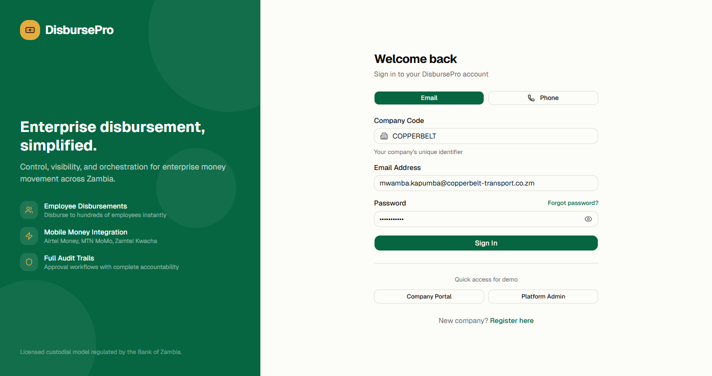
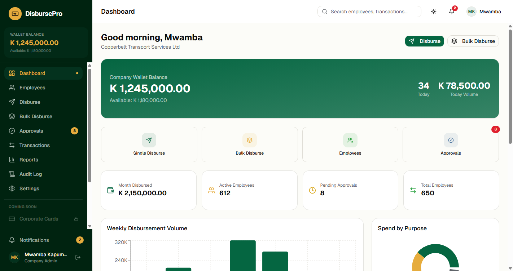
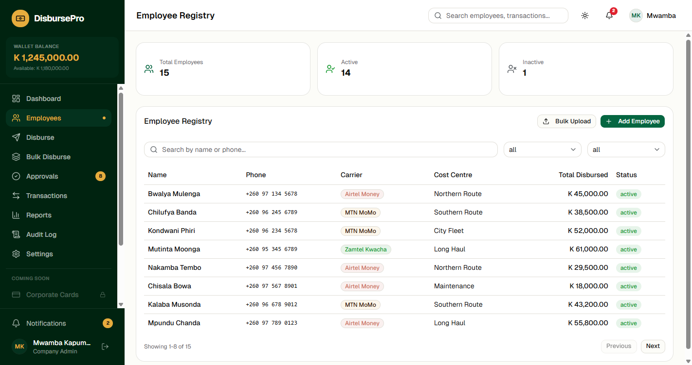
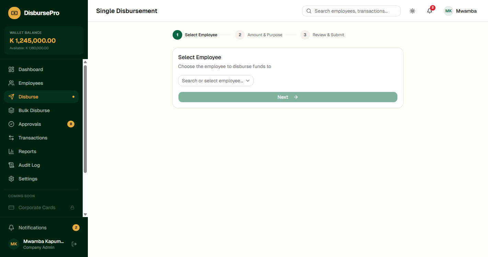
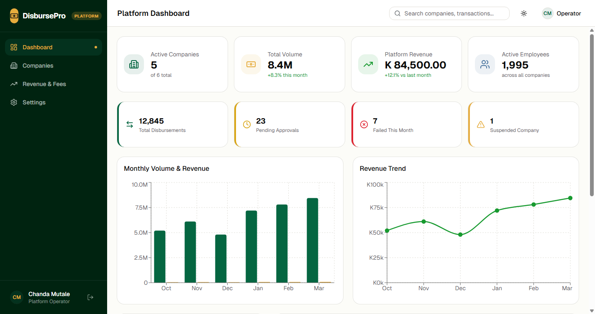
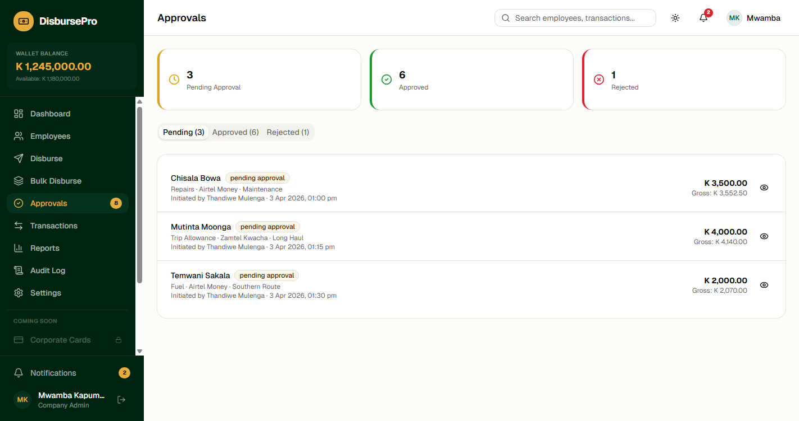
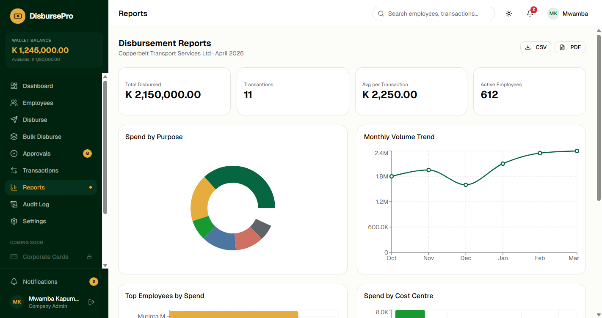
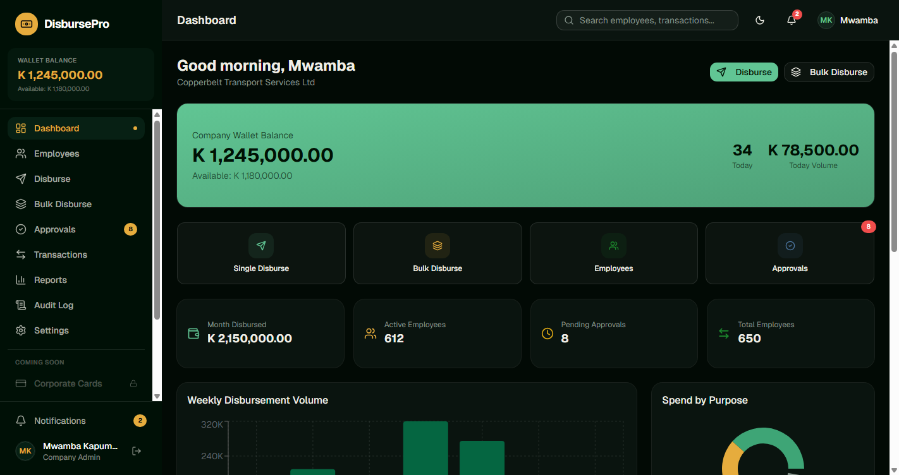
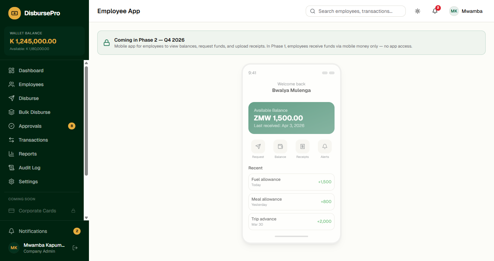

# DisbursePro

**Enterprise Disbursement & Expense Management Platform**

A next-generation disbursement platform for the Zambian market. Enterprises load funds, set approval workflows, and disburse payments to employees and drivers through mobile money — with full audit trails, real-time reporting, and structured record-keeping.

> This is a control and orchestration layer — not a banking core. Licensed custodians hold funds. We manage the workflows, approvals, and audit trails.

---

## Quick Start

```bash
# Clone the repository
git clone https://github.com/stephencoduor/disbursement-platform.git
cd disbursement-platform

# Install dependencies
npm install

# Start development server
npm run dev

# Open in browser
# http://localhost:5173
```

## Tech Stack

| Layer | Technology |
|-------|-----------|
| Framework | React 19 |
| Build Tool | Vite 8 |
| Language | TypeScript 5 (strict mode) |
| Styling | Tailwind CSS v4 |
| Components | shadcn/ui (base-ui) |
| Charts | Recharts |
| Icons | Lucide React |
| Font | Geist Variable |
| Routing | React Router v7 |
| Design System | Savanna (OKLCH) |

## Features

### Platform Operator Portal
- System-wide KPI dashboard with volume and revenue charts
- Company management with wallet crediting
- Revenue tracking and fee reporting
- Carrier integration status monitoring
- 3-tier limit configuration (Network > Platform > Company)

### Company Portal
- **Employee Registry** — Add, search, filter, paginate. Bulk CSV upload for 650+ employees
- **Single Disbursement** — 3-step flow: Select Employee → Amount/Purpose/Intent → Fee Breakdown & Submit
- **Bulk Disbursement** — CSV-driven payroll-style batch processing
- **Approval Workflows** — Pending/Approved/Rejected queues with comments
- **Transaction History** — Full audit trail with CSV/PDF export
- **Reports** — Spend by purpose, employee, period, cost centre
- **Fee Calculation Engine** — Real-time carrier fee + platform fee + levy breakdown
- **Audit Log** — Every action timestamped and filterable

### Phase 2 Previews (Visible but Inactive)
- Corporate Cards
- Self-service Deposits
- Employee Mobile App
- Multi-currency Forex
- ERP Integrations (Sage, QuickBooks, Xero, Pastel)

## Screenshots

### Login


### Company Dashboard


### Employee Registry


### Single Disbursement


### Platform Dashboard


### Approvals


### Reports


### Dark Mode


### Phase 2 - Employee App Preview


## Mock Data (Zambian Context)

All data uses realistic Zambian names, locations, and financial context:

- **Currency:** ZMW (Zambian Kwacha)
- **Phone format:** +260 97X / 96X / 95X
- **Mobile Money:** Airtel Money, MTN MoMo, Zamtel Kwacha
- **6 Companies:** Copperbelt Transport, Lusaka Fresh Foods, Zambezi Logistics, Kafue Mining, Livingstone Tourism, Kitwe Construction
- **15 Employees** across 5 cost centres
- **11 Disbursements** with full fee breakdowns

## Project Structure

```
src/
├── App.tsx                    # 28 lazy-loaded routes
├── index.css                  # Savanna design system (OKLCH)
├── components/
│   ├── layout/                # 3 layouts + 2 sidebars
│   └── ui/                    # 23 shadcn components
├── data/
│   ├── types.ts               # Domain interfaces
│   ├── companies.ts           # 6 companies
│   ├── employees.ts           # 15 employees
│   ├── disbursements.ts       # 11 transactions
│   └── fee-config.ts          # Fee calculation engine
├── lib/
│   ├── format.ts              # Currency & date formatters
│   └── theme-context.tsx      # Light/Dark/System theme
└── pages/                     # 28 pages across 4 sections
```

## User Roles

| Role | Description |
|------|-------------|
| **Platform Operator** | System admin — manages companies, credits wallets, views revenue |
| **Company Admin** | Manages company account, policies, users, approval workflows |
| **Finance User** | Initiates disbursements, manages employees, generates reports |
| **Approver** | Reviews and approves/rejects disbursement requests |
| **Auditor** | Read-only access to transactions, reports, and audit trails |

## Commands

```bash
npm run dev          # Start dev server
npm run build        # TypeScript check + production build
npm run preview      # Preview production build
npm run lint         # ESLint
npx tsc --noEmit     # TypeScript check only
```

## Related

- [NeoBank Prototype](https://github.com/stephencoduor/neobank) — Sibling project using the same Savanna design system (B2C digital banking for Kenya)

## License

Proprietary — Built by Qsoftwares Ltd
