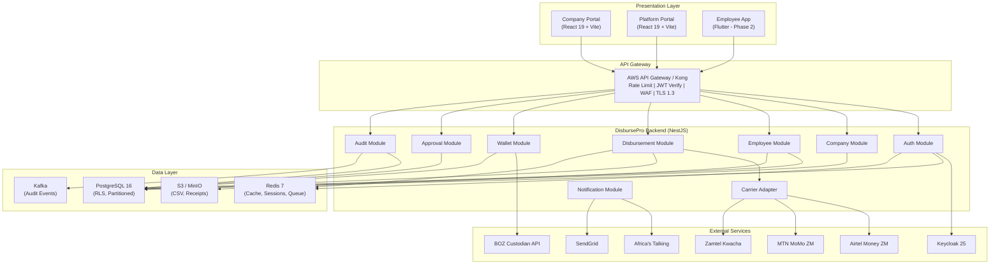
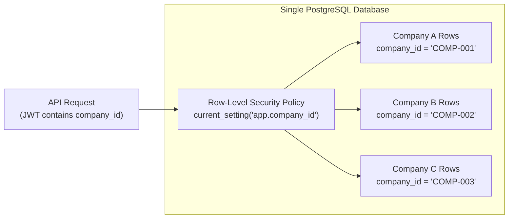
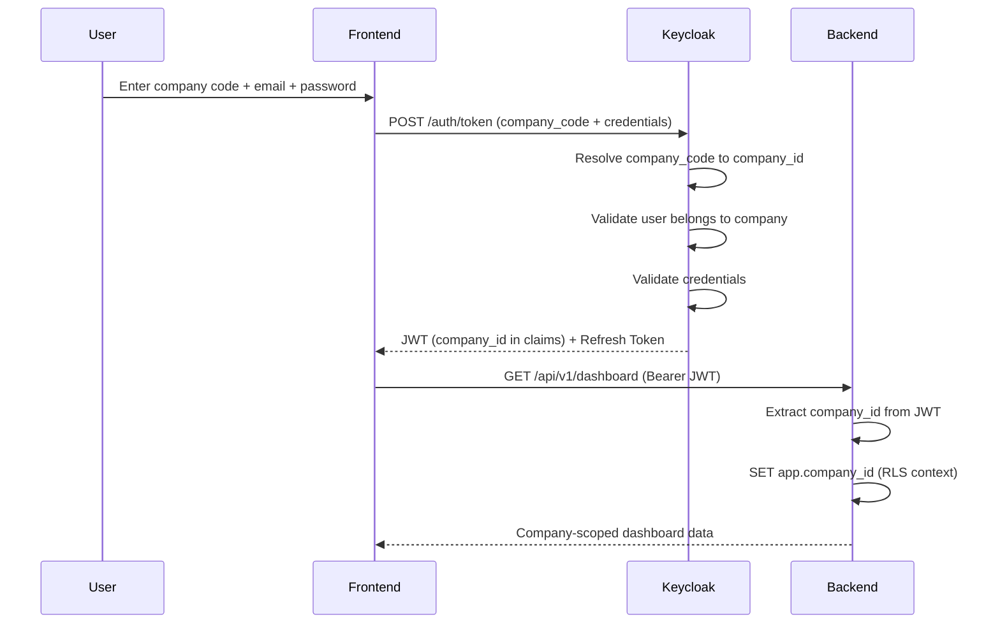
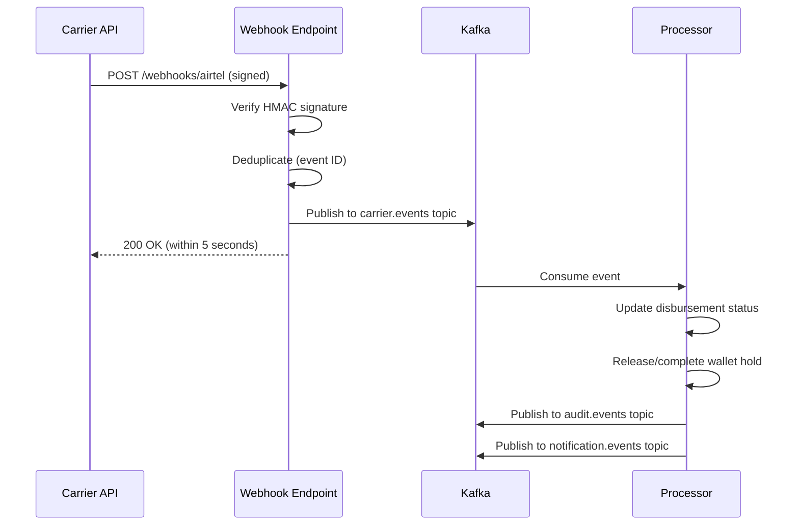
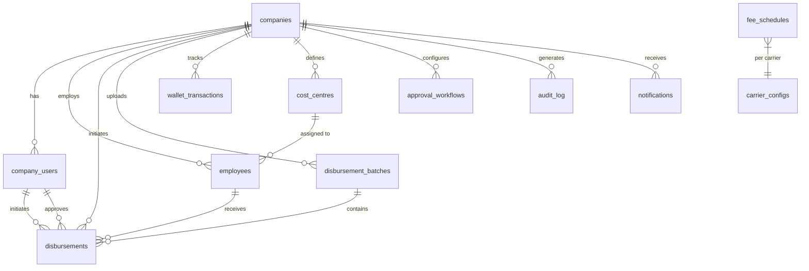
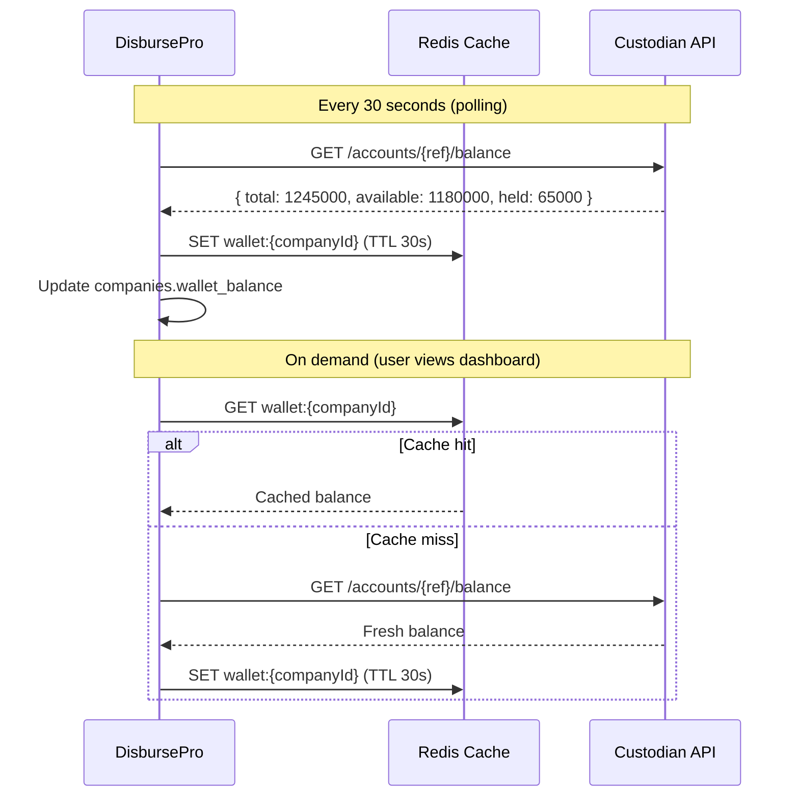
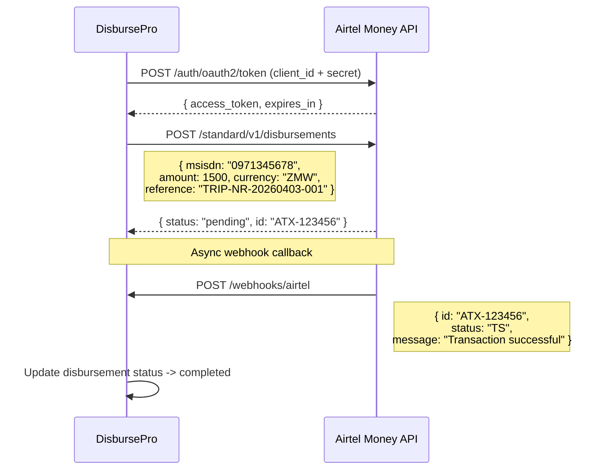
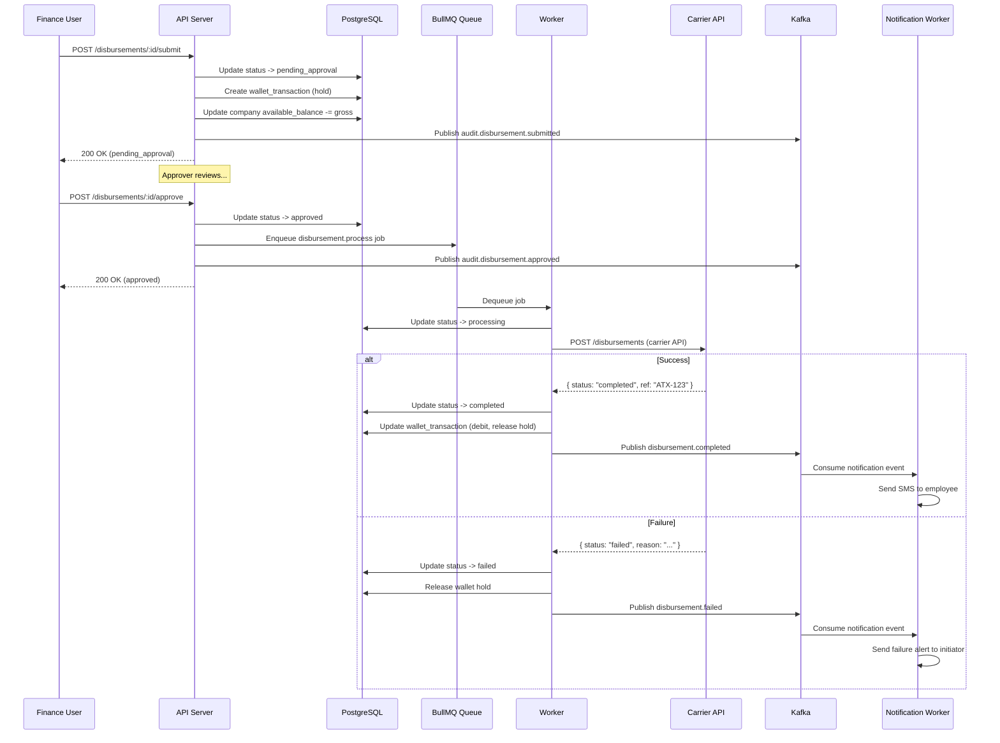

# Technical Specification

## DisbursePro — Enterprise Disbursement & Expense Management Platform

| Field | Detail |
|---|---|
| **Product** | DisbursePro — Enterprise Disbursement & Expense Management Platform |
| **Client** | Publicly traded technology company (competitive RFP) |
| **Version** | 1.0 |
| **Date** | 2026-04-04 |
| **MVP Budget** | USD 15,000 |
| **Full Build Budget** | USD 95,000 |
| **MVP Timeline** | 8 weeks |
| **Target Market** | Zambia (expanding to SADC region) |
| **Currency** | ZMW (Zambian Kwacha) |
| **Status** | Draft |

---

## Table of Contents

1. [Architecture Overview](#1-architecture-overview)
2. [Technology Stack](#2-technology-stack)
3. [Authentication & Security](#3-authentication--security)
4. [API Design](#4-api-design)
5. [Data Models](#5-data-models)
6. [Third-Party Integrations](#6-third-party-integrations)
7. [Infrastructure](#7-infrastructure)
8. [Performance Requirements](#8-performance-requirements)
9. [Testing Strategy](#9-testing-strategy)

---

## 1. Architecture Overview

### 1.1 High-Level Architecture

DisbursePro is an **orchestration layer** -- it does NOT hold customer funds, issue accounts, or act as a financial institution. Customer funds are held by a Bank of Zambia (BOZ) licensed custodian. DisbursePro manages workflows, approvals, fee calculations, carrier routing, and audit trails.

```
+--------------------------------------------------------------------+
|                     PRESENTATION LAYER                              |
|  +------------------+  +------------------+  +------------------+  |
|  |  Company Portal  |  |  Platform Portal |  |  Employee App    |  |
|  |  (React 19)      |  |  (React 19)      |  |  (Flutter - P2)  |  |
|  |  Vite + TS        |  |  Same SPA        |  |  iOS + Android   |  |
|  +--------+---------+  +--------+---------+  +--------+---------+  |
+-----------|----------------------|----------------------|-----------+
            |                      |                      |
            v                      v                      v
+--------------------------------------------------------------------+
|                      API GATEWAY LAYER                              |
|  +--------------------------------------------------------------+  |
|  |  AWS API Gateway / Kong                                       |  |
|  |  - Rate limiting (60 req/min per user)                        |  |
|  |  - Request validation (JSON Schema)                           |  |
|  |  - JWT verification (Keycloak)                                |  |
|  |  - Company-scoped request routing                             |  |
|  |  - TLS 1.3 termination                                        |  |
|  |  - WAF (OWASP ruleset)                                        |  |
|  |  - X-Company-Id header injection from JWT claims               |  |
|  +--------------------------------------------------------------+  |
+--------------------------------------------------------------------+
            |
            v
+--------------------------------------------------------------------+
|                   BACKEND SERVICES LAYER (NestJS)                    |
|                                                                    |
|  +----------------+  +----------------+  +------------------+      |
|  | Auth Module    |  | Company Module |  | Employee Module  |      |
|  | (Keycloak)     |  | (CRUD, Wallet) |  | (Registry, CSV)  |      |
|  +----------------+  +----------------+  +------------------+      |
|                                                                    |
|  +----------------+  +----------------+  +------------------+      |
|  | Disbursement   |  | Wallet Module  |  | Carrier Adapter  |      |
|  | Module         |  | (Hold/Release) |  | Module           |      |
|  | (Single/Bulk)  |  |                |  | (Airtel/MTN/Zam) |      |
|  +----------------+  +----------------+  +------------------+      |
|                                                                    |
|  +----------------+  +----------------+  +------------------+      |
|  | Approval       |  | Notification   |  | Audit Module     |      |
|  | Module         |  | Module         |  | (Immutable Log)  |      |
|  | (Workflows)    |  | (SMS/Email)    |  |                  |      |
|  +----------------+  +----------------+  +------------------+      |
|                                                                    |
|  +--------------------------------------------------------------+  |
|  |  Job Queue: BullMQ (Redis-backed)                             |  |
|  |  - Disbursement processing    - CSV bulk validation           |  |
|  |  - Carrier API calls          - Report generation             |  |
|  |  - Notification delivery      - Wallet reconciliation         |  |
|  +--------------------------------------------------------------+  |
|                                                                    |
|  +--------------------------------------------------------------+  |
|  |  Event Bus: Apache Kafka                                      |  |
|  |  - Audit events              - Carrier webhook ingestion      |  |
|  |  - Wallet balance changes    - Notification triggers          |  |
|  |  - Disbursement state changes                                 |  |
|  +--------------------------------------------------------------+  |
|                                                                    |
|  +--------------------------------------------------------------+  |
|  |  Cache: Redis 7                                               |  |
|  |  - Session management        - Rate limit counters            |  |
|  |  - OTP storage               - Idempotency keys              |  |
|  |  - Fee schedule cache        - Wallet balance cache           |  |
|  +--------------------------------------------------------------+  |
|                                                                    |
|  +--------------------------------------------------------------+  |
|  |  Primary Database: PostgreSQL 16 (RDS Multi-AZ)               |  |
|  |  - Application schema        - Audit log schema (partitioned) |  |
|  |  - Row-Level Security (RLS)  - Read replicas for reports      |  |
|  +--------------------------------------------------------------+  |
+--------------------------------------------------------------------+
            |
            v
+--------------------------------------------------------------------+
|                   EXTERNAL SERVICES LAYER                           |
|                                                                    |
|  +-------------+ +-------------+ +-------------+ +-------------+  |
|  | Custodian   | | Airtel      | | MTN MoMo    | | Zamtel      |  |
|  | API (BOZ    | | Money ZM    | | ZM API      | | Kwacha API  |  |
|  | licensed)   | | API         | |             | |             |  |
|  +-------------+ +-------------+ +-------------+ +-------------+  |
|                                                                    |
|  +-------------+ +-------------+ +-------------+                   |
|  | Keycloak 25 | | Africa's    | | SendGrid    |                   |
|  | (Auth/OIDC) | | Talking     | | (Email)     |                   |
|  |             | | (SMS/OTP)   | |             |                   |
|  +-------------+ +-------------+ +-------------+                   |
+--------------------------------------------------------------------+
```

**Architecture as Mermaid Diagram:**



### 1.2 Design Principles

1. **Orchestration Only**: DisbursePro never holds, stores, or custodies customer funds. All balance queries and disbursement instructions flow through the custodian API. The platform is a control plane, not a money container.
2. **API-First**: All services expose RESTful APIs; no module-to-module direct database access outside its bounded context.
3. **Event-Driven**: State changes published to Kafka for audit, notification, and analytics consumers. Carrier webhooks ingested through Kafka for reliable processing.
4. **Idempotency**: Every disbursement operation accepts an idempotency key; replayed requests return the original result. This is critical for carrier API calls that may timeout.
5. **Multi-Tenant Isolation**: Every query is scoped by `company_id` via PostgreSQL Row-Level Security (RLS). No application-layer tenant leakage is possible.
6. **Hold-Release Pattern**: Wallet funds are held on submission and released on rejection/failure. This prevents over-commitment when multiple disbursements are pending approval simultaneously.
7. **Fail-Safe Carrier Routing**: Carrier API calls are wrapped in circuit breakers with retry logic. Failed disbursements are retryable. No money leaves the wallet unless the carrier confirms receipt.
8. **Immutable Audit**: Every state-changing action produces an immutable audit log entry with actor, timestamp, IP, and before/after state. Audit logs are append-only and partitioned by month.

### 1.3 Service Boundaries

| Module | Responsibility | Key Dependencies |
|---|---|---|
| **Auth Module** | Authentication, authorization, session management, MFA | Keycloak 25, Redis (sessions) |
| **Company Module** | Company CRUD, company user management, onboarding | PostgreSQL, Keycloak |
| **Employee Module** | Employee registry, bulk CSV upload, carrier validation | PostgreSQL, S3 (CSV files) |
| **Disbursement Module** | Single/bulk disbursement creation, fee calculation, status tracking | PostgreSQL, BullMQ, Carrier Adapter |
| **Wallet Module** | Balance queries (custodian), hold/release, credit operations | Custodian API, PostgreSQL, Redis |
| **Carrier Adapter Module** | Unified interface to Airtel/MTN/Zamtel APIs; retry, circuit breaker | Carrier APIs, Redis, Kafka |
| **Approval Module** | Approval workflows, queue management, delegation | PostgreSQL, Notification Module |
| **Notification Module** | SMS OTP, disbursement confirmations, email reports | Africa's Talking, SendGrid |
| **Audit Module** | Immutable action logging, event consumption, export | PostgreSQL (partitioned), Kafka |
| **Report Module** | Analytics aggregation, CSV/PDF export generation | PostgreSQL (read replica), S3 |
| **Platform Module** | Platform operator: KPIs, company management, fee/limit config | PostgreSQL, all other modules |

### 1.4 Multi-Tenant Architecture

DisbursePro uses a **single database, shared schema** multi-tenant model with PostgreSQL Row-Level Security (RLS) for hard tenant isolation:



**Implementation:**

```sql
-- Enable RLS on all tenant-scoped tables
ALTER TABLE employees ENABLE ROW LEVEL SECURITY;
ALTER TABLE disbursements ENABLE ROW LEVEL SECURITY;
ALTER TABLE wallet_transactions ENABLE ROW LEVEL SECURITY;

-- Policy: users can only see rows for their company
CREATE POLICY tenant_isolation ON employees
    USING (company_id = current_setting('app.company_id')::UUID);

CREATE POLICY tenant_isolation ON disbursements
    USING (company_id = current_setting('app.company_id')::UUID);
```

**NestJS middleware sets the tenant context on every request:**

```typescript
// tenant.middleware.ts
@Injectable()
export class TenantMiddleware implements NestMiddleware {
  constructor(private readonly prisma: PrismaService) {}

  async use(req: Request, res: Response, next: NextFunction) {
    const companyId = req.user?.companyId; // Extracted from JWT
    if (companyId) {
      await this.prisma.$executeRaw`SELECT set_config('app.company_id', ${companyId}, true)`;
    }
    next();
  }
}
```

**Platform operators bypass RLS** via a separate database role (`disbursepro_platform`) that has `BYPASSRLS` privilege, enabling cross-company queries for the platform dashboard and company management views.

---

## 2. Technology Stack

### 2.1 Frontend -- Web Application

| Component | Technology | Version | Purpose |
|---|---|---|---|
| Framework | React | 19.x | Component-based UI |
| Build Tool | Vite | 8.x | Fast HMR, optimized builds |
| Language | TypeScript | 5.x | Type safety |
| Styling | Tailwind CSS | 4.x | Utility-first CSS with Lagoon design tokens |
| Component Library | shadcn/ui (base-ui) | Latest | Accessible, customizable components |
| State Management | Zustand | 5.x | Lightweight global state (wallet balance, user context) |
| Data Fetching | TanStack Query | 5.x | Server state with caching, optimistic updates |
| Routing | React Router | 7.x | Client-side routing with lazy loading |
| Forms | React Hook Form + Zod | Latest | Form validation with TypeScript schemas |
| Charts | Recharts | 2.x | Dashboard visualizations (volume, revenue, carrier breakdown) |
| Icons | Lucide React | Latest | Consistent icon set |
| Font | Plus Jakarta Sans | Variable | Premium, professional typography |
| CSV Parsing | Papa Parse | Latest | Client-side CSV parsing for bulk uploads |
| File Upload | react-dropzone | Latest | Drag-and-drop CSV upload zone |
| Date Handling | date-fns | Latest | Date formatting, comparison (CAT timezone) |
| Testing | Vitest + React Testing Library | Latest | Unit and component tests |
| E2E Testing | Playwright | Latest | End-to-end browser tests |

**Build Targets:**
- Company portal: `https://app.disbursepro.com` (company admin, finance, approver, auditor)
- Platform portal: `https://platform.disbursepro.com` (platform operators)
- Both are the same SPA with role-gated route rendering

### 2.2 Frontend -- Mobile Application (Phase 2)

| Component | Technology | Version | Purpose |
|---|---|---|---|
| Framework | Flutter | 3.x | Cross-platform (iOS + Android) |
| Language | Dart | 3.x | Type-safe, AOT compiled |
| State Management | Riverpod | 2.x | Reactive, testable state |
| HTTP Client | Dio | 5.x | HTTP with interceptors, retry |
| Secure Storage | flutter_secure_storage | Latest | Keychain (iOS) / KeyStore (Android) |
| Push | firebase_messaging | Latest | FCM push notifications |

**Minimum Platform Requirements:**
- Android: API 26 (Android 8.0 Oreo) -- covers 95%+ of Zambian Android devices
- iOS: 14.0

### 2.3 Backend

| Component | Technology | Version | Purpose |
|---|---|---|---|
| Runtime | Node.js | 22 LTS | Backend runtime |
| Framework | NestJS | 10.x | Modular backend framework with DI |
| Language | TypeScript | 5.x | Type safety end-to-end |
| ORM | Prisma | 6.x | Type-safe database access, migrations |
| IAM | Keycloak | 25.x | OAuth2 / OIDC / RBAC, multi-tenant |
| API Gateway | Kong / AWS API Gateway | Latest | Routing, rate limiting, JWT verification |
| Job Queue | BullMQ | 5.x | Redis-backed async job processing |
| Event Bus | Apache Kafka | 3.8.x | Audit events, carrier webhooks |
| Cache | Redis | 7.x | Sessions, rate limits, idempotency, fee cache |
| Database | PostgreSQL | 16.x | Primary RDBMS with RLS |
| Object Storage | AWS S3 / MinIO | Latest | CSV uploads, receipts, export files |
| Validation | class-validator + class-transformer | Latest | DTO validation |
| HTTP Client | Axios | Latest | Carrier API calls with interceptors |
| Resilience | cockatiel | Latest | Circuit breaker, retry, timeout for carrier calls |
| Observability | OpenTelemetry | Latest | Distributed tracing, metrics |

### 2.4 DevOps & Infrastructure

| Component | Technology | Purpose |
|---|---|---|
| Container Runtime | Docker | Containerization |
| Orchestration | Kubernetes (AWS EKS) | Container orchestration |
| CI/CD | GitHub Actions | Build, test, deploy pipelines |
| IaC | Terraform | AWS infrastructure provisioning |
| Container Registry | AWS ECR | Docker image storage |
| Secrets | AWS Secrets Manager | API keys, database credentials, carrier tokens |
| CDN | AWS CloudFront | Static asset delivery |
| DNS | AWS Route 53 | Domain management |
| WAF | AWS WAF | Web application firewall |
| Logging | CloudWatch + Loki | Centralized logging |
| Monitoring | Grafana + Prometheus | Metrics dashboards |
| Error Tracking | Sentry | Runtime error tracking |
| APM | Grafana Tempo | Distributed tracing |

---

## 3. Authentication & Security

### 3.1 Authentication Flow

#### 3.1.1 OAuth2 + JWT (Keycloak)

```
User                   App                Keycloak              Backend
 |                      |                    |                     |
 |-- Company Code +     |                    |                     |
 |   Email + Password ->|                    |                     |
 |                      |-- POST /token ---->|                     |
 |                      |   (Resource Owner   |                     |
 |                      |    Password Grant)  |                     |
 |                      |   + company_code    |                     |
 |                      |                    |-- Validate creds ---|
 |                      |                    |-- Check company_id -|
 |                      |                    |<- OK ---------------|
 |                      |<- Access Token ----|                     |
 |                      |   (JWT, 15 min)    |                     |
 |                      |   + Refresh Token  |                     |
 |                      |   (opaque, 30 day) |                     |
 |                      |                    |                     |
 |                      |-- GET /dashboard ->|                     |
 |                      |   Authorization:   |                     |
 |                      |   Bearer <JWT>     |-- Verify JWT ------>|
 |                      |                    |-- Extract company_id|
 |                      |                    |-- Set RLS context --|
 |                      |<- Scoped data -----|---------------------|
```

**JWT Claims:**

```json
{
  "sub": "USR-001",
  "iss": "https://auth.disbursepro.com/realms/disbursepro",
  "aud": "disbursepro-web",
  "exp": 1743724200,
  "iat": 1743723300,
  "company_id": "COMP-001",
  "company_code": "CPTRAN",
  "role": "company_admin",
  "permissions": [
    "disbursements:initiate",
    "disbursements:view",
    "employees:manage",
    "settings:manage",
    "reports:view",
    "audit:view",
    "users:manage"
  ],
  "name": "Mwamba Kapumba",
  "email": "mwamba.kapumba@copperbelt-transport.co.zm"
}
```

**Keycloak Configuration:**

| Setting | Value |
|---|---|
| Realm | `disbursepro` (single realm, company-scoped via custom attribute) |
| Clients | `disbursepro-web`, `disbursepro-api`, `disbursepro-mobile` (Phase 2) |
| Token lifespan (access) | 15 minutes |
| Token lifespan (refresh) | 30 days |
| Refresh token rotation | Enabled (one-time use) |
| Brute force protection | Enabled (5 failures = 30-minute lockout) |
| Password policy | 8+ chars, uppercase, lowercase, digit, special char |
| Custom attributes | `company_id`, `company_code`, `role` |
| Required actions | Email verification (on registration) |

#### 3.1.2 Company Code Authentication

The company code is a 6-character alphanumeric identifier (e.g., "CPTRAN" for Copperbelt Transport) that scopes login to the correct company. It is entered on the login form alongside email/phone and password.



Platform operators log in **without** a company code -- their JWT contains `role: "platform_operator"` and no `company_id` claim, granting cross-company access.

### 3.2 Role-Based Access Control (RBAC)

#### 3.2.1 Role Definitions

| Role | Scope | Description |
|---|---|---|
| `platform_operator` | System-wide | DisbursePro staff: manage companies, credit wallets, configure fees/limits, view revenue |
| `company_admin` | Single company | Company-level admin: manage users, configure limits, view all data, manage settings |
| `finance_user` | Single company | Initiate disbursements, manage employees, view transactions |
| `approver` | Single company | Approve/reject disbursements, view approval queue |
| `auditor` | Single company | Read-only access to transactions, reports, and audit log |

#### 3.2.2 Permission Matrix

| Permission | Platform Operator | Company Admin | Finance User | Approver | Auditor |
|---|---|---|---|---|---|
| **Authentication** | | | | | |
| Login (no company code) | Yes | -- | -- | -- | -- |
| Login (with company code) | -- | Yes | Yes | Yes | Yes |
| **Platform Management** | | | | | |
| View platform dashboard | Yes | -- | -- | -- | -- |
| Manage companies | Yes | -- | -- | -- | -- |
| Credit company wallets | Yes | -- | -- | -- | -- |
| Configure fee schedules | Yes | -- | -- | -- | -- |
| Configure platform limits | Yes | -- | -- | -- | -- |
| Manage carrier status | Yes | -- | -- | -- | -- |
| View platform revenue | Yes | -- | -- | -- | -- |
| View platform audit log | Yes | -- | -- | -- | -- |
| **Company Management** | | | | | |
| View company dashboard | -- | Yes | Yes | Yes | Yes |
| Manage company users | -- | Yes | -- | -- | -- |
| Configure company limits | -- | Yes | -- | -- | -- |
| Manage cost centres | -- | Yes | -- | -- | -- |
| Configure approval workflows | -- | Yes | -- | -- | -- |
| **Employee Management** | | | | | |
| View employees | -- | Yes | Yes | Yes | Yes |
| Add/edit employees | -- | Yes | Yes | -- | -- |
| Bulk upload employees | -- | Yes | Yes | -- | -- |
| Deactivate employees | -- | Yes | Yes | -- | -- |
| **Disbursements** | | | | | |
| Initiate single disbursement | -- | Yes | Yes | -- | -- |
| Initiate bulk disbursement | -- | Yes | Yes | -- | -- |
| View disbursement detail | -- | Yes | Yes | Yes | Yes |
| Approve/reject disbursement | -- | -- | -- | Yes | -- |
| **Wallet** | | | | | |
| View wallet balance | -- | Yes | Yes | Yes | Yes |
| View wallet transactions | -- | Yes | Yes | -- | Yes |
| **Transactions & Reports** | | | | | |
| View transaction history | -- | Yes | Yes | Yes | Yes |
| Export CSV | -- | Yes | Yes | -- | Yes |
| Export PDF | -- | Yes | -- | -- | Yes |
| View reports | -- | Yes | Yes | -- | Yes |
| **Audit** | | | | | |
| View audit log | -- | Yes | -- | -- | Yes |
| Export audit log | -- | Yes | -- | -- | Yes |
| **Settings** | | | | | |
| View settings | -- | Yes | -- | -- | -- |
| Edit settings | -- | Yes | -- | -- | -- |

### 3.3 Multi-Factor Authentication (MFA)

| Scenario | MFA Type | Required For |
|---|---|---|
| High-value disbursement approval (> ZMW 2,000) | SMS OTP | Approvers (mandatory) |
| Settings changes (limits, users, cost centres) | SMS OTP | Company Admin |
| Platform operator login | TOTP (authenticator app) | Platform Operator (mandatory) |
| Password reset | SMS OTP + Email link | All roles |

**SMS OTP Flow:**

```
1. User triggers MFA-protected action
2. Backend generates 6-digit OTP, stores in Redis (TTL: 5 minutes)
3. SMS sent via Africa's Talking to registered +260 phone number
4. User enters OTP in frontend dialog
5. Backend validates OTP (max 3 attempts, then regenerate)
6. On success: action proceeds; on failure: action blocked
```

### 3.4 API Security

```
Request Flow:
Client -> TLS 1.3 -> WAF -> API Gateway -> JWT Verify -> Rate Limit -> Tenant Context -> Backend

Security Headers (all responses):
  Content-Security-Policy: default-src 'self'
  X-Content-Type-Options: nosniff
  X-Frame-Options: DENY
  X-XSS-Protection: 1; mode=block
  Referrer-Policy: strict-origin-when-cross-origin
  Strict-Transport-Security: max-age=31536000; includeSubDomains; preload
```

| Mechanism | Detail |
|---|---|
| Authentication | Bearer JWT (Keycloak-issued) on every request |
| Rate limiting | 60 requests/minute per user; 10/minute for auth endpoints |
| Request signing | HMAC-SHA256 on carrier webhook payloads |
| Idempotency | `X-Idempotency-Key` header required on all POST disbursement operations |
| IP whitelisting | Platform operator restricted to office IP + VPN |
| Input validation | Zod schemas on frontend; class-validator DTOs on backend |
| SQL injection | Prisma parameterized queries; no raw SQL |
| CSRF | SameSite=Strict cookies + CSRF tokens for web |
| Encryption at rest | AES-256 for database (RDS), S3 (SSE-KMS) |
| Encryption in transit | TLS 1.3 (minimum TLS 1.2) for all connections |
| Key management | AWS KMS; automatic rotation every 90 days |

### 3.5 Carrier Webhook Authentication

Carrier APIs deliver status callbacks to DisbursePro. Each carrier uses a different authentication method:

| Carrier | Webhook Auth | Verification |
|---|---|---|
| Airtel Money ZM | HMAC-SHA256 signature in `X-Airtel-Signature` header | Verify with shared secret |
| MTN MoMo ZM | API key in `X-Callback-Token` header | Compare with stored subscription key |
| Zamtel Kwacha | IP whitelist + basic auth | Validate source IP + credentials |

```typescript
// Carrier webhook verification middleware
@Injectable()
export class CarrierWebhookGuard implements CanActivate {
  canActivate(context: ExecutionContext): boolean {
    const request = context.switchToHttp().getRequest();
    const carrier = request.params.carrier;

    switch (carrier) {
      case 'airtel_money':
        return this.verifyHmacSignature(request, this.config.airtelSecret);
      case 'mtn_momo':
        return request.headers['x-callback-token'] === this.config.mtnCallbackToken;
      case 'zamtel_kwacha':
        return this.verifyIpWhitelist(request) && this.verifyBasicAuth(request);
      default:
        return false;
    }
  }
}
```

---

## 4. API Design

### 4.1 API Standards

| Standard | Detail |
|---|---|
| Protocol | HTTPS (REST) |
| Format | JSON (`application/json`) |
| Versioning | URL path: `/api/v1/` |
| Pagination | Cursor-based: `?cursor=xxx&limit=20` (default 20, max 100) |
| Filtering | Query parameters: `?status=pending&carrier=airtel_money&purpose=fuel` |
| Sorting | `?sort=created_at&order=desc` |
| Error format | `{ "error": { "code": "ERR_INSUFFICIENT_BALANCE", "message": "...", "details": [...], "traceId": "..." } }` |
| Date format | ISO 8601: `2026-04-03T14:30:00+02:00` (CAT timezone) |
| Money format | Decimal with 2 places: `{ "amount": 1500.00, "currency": "ZMW" }` |
| Idempotency | `X-Idempotency-Key: <UUID v4>` on all POST disbursement operations |
| Correlation | `X-Request-Id: <UUID v4>` generated by gateway, propagated through all services |
| Tenant | `X-Company-Id` injected by gateway from JWT claims (not user-supplied) |

### 4.2 Error Response Format

All errors follow a consistent structure:

```json
{
  "error": {
    "code": "ERR_INSUFFICIENT_BALANCE",
    "message": "Insufficient wallet balance. Available: ZMW 1,180.00, Required: ZMW 4,140.00 (gross amount including fees).",
    "details": [
      {
        "field": "netAmount",
        "constraint": "walletBalance",
        "available": 1180.00,
        "required": 4140.00
      }
    ],
    "traceId": "a1b2c3d4-e5f6-7890-abcd-ef1234567890"
  }
}
```

**Standard Error Codes:**

| Code | HTTP Status | Description |
|---|---|---|
| `ERR_UNAUTHORIZED` | 401 | Missing or invalid authentication token |
| `ERR_FORBIDDEN` | 403 | Insufficient permissions for this action |
| `ERR_NOT_FOUND` | 404 | Resource not found or not in tenant scope |
| `ERR_VALIDATION` | 422 | Input validation failure |
| `ERR_INSUFFICIENT_BALANCE` | 422 | Wallet available balance too low |
| `ERR_LIMIT_EXCEEDED` | 422 | Disbursement exceeds tier limit |
| `ERR_DUPLICATE_DISBURSEMENT` | 409 | Potential duplicate detected (advisory) |
| `ERR_EMPLOYEE_INACTIVE` | 422 | Employee is not active |
| `ERR_CARRIER_UNAVAILABLE` | 503 | Carrier API is down or degraded |
| `ERR_IDEMPOTENCY_CONFLICT` | 409 | Idempotency key already used with different payload |
| `ERR_RATE_LIMIT` | 429 | Too many requests |
| `ERR_INTERNAL` | 500 | Unexpected server error |

### 4.3 API Endpoints

#### 4.3.1 Authentication (`/api/v1/auth`)

```
POST   /api/v1/auth/login                  # Login (company code + email + password)
POST   /api/v1/auth/register               # Company self-registration (Phase 2)
POST   /api/v1/auth/token/refresh           # Refresh access token
POST   /api/v1/auth/mfa/request             # Request MFA OTP
POST   /api/v1/auth/mfa/verify              # Verify MFA OTP
POST   /api/v1/auth/password/change         # Change password
POST   /api/v1/auth/password/reset-request  # Request password reset
POST   /api/v1/auth/password/reset          # Reset password with token + OTP
POST   /api/v1/auth/logout                  # Logout (invalidate tokens)
GET    /api/v1/auth/me                      # Current user profile
```

**Example: Login**

```http
POST /api/v1/auth/login
Content-Type: application/json

{
  "companyCode": "CPTRAN",
  "email": "mwamba.kapumba@copperbelt-transport.co.zm",
  "password": "S3cure!Pass"
}

Response: 200 OK
{
  "data": {
    "accessToken": "eyJhbGciOiJSUzI1NiIs...",
    "refreshToken": "dGhpcyBpcyBhIHJlZn...",
    "expiresIn": 900,
    "tokenType": "Bearer",
    "user": {
      "id": "USR-001",
      "firstName": "Mwamba",
      "lastName": "Kapumba",
      "email": "mwamba.kapumba@copperbelt-transport.co.zm",
      "role": "company_admin",
      "companyId": "COMP-001",
      "companyName": "Copperbelt Transport Services Ltd"
    }
  }
}
```

**Example: Login (Platform Operator -- no company code)**

```http
POST /api/v1/auth/login
Content-Type: application/json

{
  "email": "chanda.mutale@disbursepro.com",
  "password": "Pl@tformOps!2026"
}

Response: 200 OK
{
  "data": {
    "accessToken": "eyJhbGciOiJSUzI1NiIs...",
    "refreshToken": "...",
    "expiresIn": 900,
    "tokenType": "Bearer",
    "mfaRequired": true,
    "mfaChallenge": "TOTP"
  }
}
```

#### 4.3.2 Companies (`/api/v1/companies`) -- Platform Operator Only

```
GET    /api/v1/companies                       # List all companies (paginated)
POST   /api/v1/companies                       # Create company (platform operator)
GET    /api/v1/companies/:id                    # Company detail
PUT    /api/v1/companies/:id                    # Update company
POST   /api/v1/companies/:id/suspend            # Suspend company
POST   /api/v1/companies/:id/unsuspend          # Unsuspend company
GET    /api/v1/companies/:id/stats              # Company statistics
GET    /api/v1/companies/:id/wallet             # Company wallet details
POST   /api/v1/companies/:id/wallet/credit      # Credit company wallet
GET    /api/v1/companies/:id/wallet/transactions # Wallet transaction history
GET    /api/v1/companies/:id/users              # List company users
GET    /api/v1/companies/:id/transactions       # Company transactions (for platform view)
```

**Example: Credit Company Wallet**

```http
POST /api/v1/companies/COMP-001/wallet/credit
Authorization: Bearer <platform_operator_jwt>
X-Idempotency-Key: 550e8400-e29b-41d4-a716-446655440000
Content-Type: application/json

{
  "amount": 500000.00,
  "currency": "ZMW",
  "bankTransferReference": "FNB-20260402-TRF-8821",
  "notes": "Bank transfer received 2026-04-02"
}

Response: 201 Created
{
  "data": {
    "transactionId": "WT-20260402-001",
    "type": "credit",
    "amount": 500000.00,
    "currency": "ZMW",
    "previousBalance": 745000.00,
    "newBalance": 1245000.00,
    "previousAvailable": 680000.00,
    "newAvailable": 1180000.00,
    "bankTransferReference": "FNB-20260402-TRF-8821",
    "creditedBy": "Chanda Mutale",
    "createdAt": "2026-04-02T14:30:00+02:00"
  }
}
```

#### 4.3.3 Employees (`/api/v1/employees`) -- Company Scoped

```
GET    /api/v1/employees                        # List employees (paginated, filtered)
POST   /api/v1/employees                        # Add single employee
GET    /api/v1/employees/:id                     # Employee detail + disbursement history
PUT    /api/v1/employees/:id                     # Update employee
POST   /api/v1/employees/:id/deactivate          # Deactivate employee
POST   /api/v1/employees/:id/reactivate          # Reactivate employee
POST   /api/v1/employees/bulk-upload             # Upload CSV (returns validation result)
POST   /api/v1/employees/bulk-upload/:batchId/confirm  # Confirm valid rows
GET    /api/v1/employees/export                  # Export to CSV
GET    /api/v1/employees/template                # Download CSV template
```

**Example: Add Single Employee**

```http
POST /api/v1/employees
Authorization: Bearer <company_user_jwt>
Content-Type: application/json

{
  "firstName": "Bwalya",
  "lastName": "Mulenga",
  "phone": "+260971345678",
  "nrc": "123456/78/1",
  "carrier": "airtel_money",
  "costCentre": "Northern Route",
  "department": "Drivers"
}

Response: 201 Created
{
  "data": {
    "id": "EMP-001",
    "companyId": "COMP-001",
    "firstName": "Bwalya",
    "lastName": "Mulenga",
    "phone": "+260971345678",
    "nrc": "123456/78/1",
    "carrier": "airtel_money",
    "costCentre": "Northern Route",
    "department": "Drivers",
    "status": "active",
    "totalDisbursed": 0,
    "lastDisbursement": null,
    "createdAt": "2026-04-03T08:00:00+02:00",
    "carrierWarning": null
  }
}
```

**Example: Bulk Upload CSV**

```http
POST /api/v1/employees/bulk-upload
Authorization: Bearer <company_user_jwt>
Content-Type: multipart/form-data

file: employees.csv (max 5MB)

Response: 200 OK
{
  "data": {
    "batchId": "BATCH-EMP-20260403-001",
    "totalRows": 48,
    "validRows": 45,
    "errorRows": 3,
    "errors": [
      { "row": 12, "field": "phone", "message": "Invalid phone format: must start with +260" },
      { "row": 23, "field": "nrc", "message": "Invalid NRC format: expected XXXXXX/XX/X" },
      { "row": 41, "field": "carrier", "message": "Unknown carrier: 'vodafone'. Valid: airtel_money, mtn_momo, zamtel_kwacha" }
    ],
    "preview": [
      { "firstName": "Kondwani", "lastName": "Phiri", "phone": "+260962345678", "carrier": "mtn_momo", "valid": true },
      { "firstName": "Mutinta", "lastName": "Moonga", "phone": "+260953456789", "carrier": "zamtel_kwacha", "valid": true }
    ]
  }
}
```

#### 4.3.4 Disbursements (`/api/v1/disbursements`) -- Company Scoped

```
POST   /api/v1/disbursements                    # Create draft disbursement
GET    /api/v1/disbursements                    # List disbursements (paginated, filtered)
GET    /api/v1/disbursements/:id                 # Disbursement detail
POST   /api/v1/disbursements/:id/submit          # Submit for approval (draft -> pending)
POST   /api/v1/disbursements/:id/approve         # Approve (pending -> approved -> processing)
POST   /api/v1/disbursements/:id/reject          # Reject (pending -> rejected)
POST   /api/v1/disbursements/:id/retry           # Retry failed disbursement
GET    /api/v1/disbursements/:id/timeline        # Status timeline with timestamps
POST   /api/v1/disbursements/calculate-fees      # Calculate fees without creating
POST   /api/v1/disbursements/check-duplicate     # Check for potential duplicates
```

**Example: Create Single Disbursement**

```http
POST /api/v1/disbursements
Authorization: Bearer <finance_user_jwt>
X-Idempotency-Key: 660e9500-f39c-52e5-b827-557766551111
Content-Type: application/json

{
  "employeeId": "EMP-001",
  "netAmount": 1500.00,
  "currency": "ZMW",
  "purpose": "fuel",
  "intent": "withdrawal",
  "costCentre": "Northern Route",
  "notes": "Ndola to Solwezi fuel allowance"
}

Response: 201 Created
{
  "data": {
    "id": "DSB-0101",
    "companyId": "COMP-001",
    "employeeId": "EMP-001",
    "employeeName": "Bwalya Mulenga",
    "employeePhone": "+260971345678",
    "carrier": "airtel_money",
    "netAmount": 1500.00,
    "carrierFee": 37.50,
    "platformFee": 15.00,
    "levy": 0.00,
    "grossAmount": 1552.50,
    "currency": "ZMW",
    "purpose": "fuel",
    "intent": "withdrawal",
    "reference": "TRIP-NR-20260403-001",
    "costCentre": "Northern Route",
    "notes": "Ndola to Solwezi fuel allowance",
    "status": "draft",
    "initiatedBy": "Thandiwe Mulenga",
    "approvedBy": null,
    "createdAt": "2026-04-03T08:30:00+02:00",
    "feeBreakdown": {
      "carrierRate": "2.5% (Airtel Money withdrawal)",
      "platformRate": "1.0% (min ZMW 2.00)",
      "levyRate": "0.0%"
    },
    "duplicateWarning": null
  }
}
```

**Example: Approve Disbursement**

```http
POST /api/v1/disbursements/DSB-0101/approve
Authorization: Bearer <approver_jwt>
Content-Type: application/json

{
  "comment": "Approved - regular route fuel"
}

Response: 200 OK
{
  "data": {
    "id": "DSB-0101",
    "status": "approved",
    "approvedBy": "Joseph Banda",
    "approvedAt": "2026-04-03T08:45:00+02:00",
    "approverComment": "Approved - regular route fuel",
    "processingStarted": true,
    "estimatedCompletion": "2026-04-03T08:46:00+02:00"
  }
}
```

#### 4.3.5 Bulk Disbursements (`/api/v1/disbursements/bulk`) -- Company Scoped

```
POST   /api/v1/disbursements/bulk                # Upload CSV for bulk disbursement
GET    /api/v1/disbursements/bulk/:batchId        # Batch detail
POST   /api/v1/disbursements/bulk/:batchId/submit # Submit batch for approval
POST   /api/v1/disbursements/bulk/:batchId/approve # Approve entire batch
POST   /api/v1/disbursements/bulk/:batchId/reject  # Reject entire batch
POST   /api/v1/disbursements/bulk/:batchId/items/:itemId/approve  # Approve single item
POST   /api/v1/disbursements/bulk/:batchId/items/:itemId/reject   # Reject single item
GET    /api/v1/disbursements/bulk/:batchId/progress # Processing progress
GET    /api/v1/disbursements/bulk/template         # Download CSV template
```

**Example: Upload Bulk Disbursement CSV**

```http
POST /api/v1/disbursements/bulk
Authorization: Bearer <finance_user_jwt>
Content-Type: multipart/form-data

file: disbursements.csv

Response: 200 OK
{
  "data": {
    "batchId": "BATCH-20260403-001",
    "fileName": "disbursements.csv",
    "totalRows": 50,
    "validRows": 48,
    "errorRows": 2,
    "summary": {
      "totalNetAmount": 125000.00,
      "totalCarrierFees": 3125.00,
      "totalPlatformFees": 1250.00,
      "totalLevies": 0.00,
      "totalGrossAmount": 129375.00,
      "byCarrier": {
        "airtel_money": { "count": 22, "netAmount": 55000.00 },
        "mtn_momo": { "count": 18, "netAmount": 45000.00 },
        "zamtel_kwacha": { "count": 8, "netAmount": 25000.00 }
      }
    },
    "walletAvailable": 1180000.00,
    "sufficient": true,
    "errors": [
      { "row": 15, "field": "employeeId", "message": "Employee EMP-999 not found" },
      { "row": 33, "field": "netAmount", "message": "Exceeds per-transaction limit of ZMW 5,000" }
    ]
  }
}
```

#### 4.3.6 Wallet (`/api/v1/wallet`) -- Company Scoped

```
GET    /api/v1/wallet/balance                   # Current wallet balance
GET    /api/v1/wallet/transactions              # Wallet transaction history (paginated)
GET    /api/v1/wallet/transactions/:id          # Wallet transaction detail
```

**Example: Get Wallet Balance**

```http
GET /api/v1/wallet/balance
Authorization: Bearer <company_user_jwt>

Response: 200 OK
{
  "data": {
    "companyId": "COMP-001",
    "totalBalance": 1245000.00,
    "availableBalance": 1180000.00,
    "heldBalance": 65000.00,
    "currency": "ZMW",
    "lastFunded": "2026-04-02T14:30:00+02:00",
    "lastUpdated": "2026-04-03T10:30:00+02:00"
  }
}
```

#### 4.3.7 Transactions (`/api/v1/transactions`) -- Company Scoped

```
GET    /api/v1/transactions                     # List all transactions (paginated, filtered)
GET    /api/v1/transactions/:id                  # Transaction detail
GET    /api/v1/transactions/export               # Export CSV/PDF
GET    /api/v1/transactions/summary              # Aggregate summary for date range
```

**Example: List Transactions with Filters**

```http
GET /api/v1/transactions?status=completed&carrier=airtel_money&purpose=fuel&from=2026-04-01&to=2026-04-03&limit=25
Authorization: Bearer <company_user_jwt>

Response: 200 OK
{
  "data": {
    "items": [
      {
        "id": "DSB-0101",
        "reference": "TRIP-NR-20260403-001",
        "employeeName": "Bwalya Mulenga",
        "netAmount": 1500.00,
        "carrierFee": 37.50,
        "platformFee": 15.00,
        "grossAmount": 1552.50,
        "purpose": "fuel",
        "intent": "withdrawal",
        "carrier": "airtel_money",
        "costCentre": "Northern Route",
        "status": "completed",
        "initiatedBy": "Thandiwe Mulenga",
        "approvedBy": "Joseph Banda",
        "createdAt": "2026-04-03T08:30:00+02:00",
        "completedAt": "2026-04-03T08:46:12+02:00"
      }
    ],
    "pagination": {
      "cursor": "eyJpZCI6IkRTQi0wMTAxIn0=",
      "hasMore": true,
      "total": 142
    }
  }
}
```

#### 4.3.8 Reports (`/api/v1/reports`) -- Company Scoped

```
GET    /api/v1/reports/by-purpose               # Spend by purpose (donut chart data)
GET    /api/v1/reports/by-employee               # Top employees by disbursement volume
GET    /api/v1/reports/by-period                 # Volume over time (daily/weekly/monthly)
GET    /api/v1/reports/by-cost-centre            # Spend by cost centre
GET    /api/v1/reports/by-carrier                # Carrier distribution + fee analysis
GET    /api/v1/reports/failed                    # Failed disbursement report
```

**Example: Spend by Purpose**

```http
GET /api/v1/reports/by-purpose?from=2026-03-01&to=2026-04-03
Authorization: Bearer <company_user_jwt>

Response: 200 OK
{
  "data": {
    "period": { "from": "2026-03-01", "to": "2026-04-03" },
    "totalDisbursed": 2150000.00,
    "breakdown": [
      { "purpose": "fuel", "amount": 850000.00, "percentage": 39.5, "count": 1240 },
      { "purpose": "trip_allowance", "amount": 420000.00, "percentage": 19.5, "count": 340 },
      { "purpose": "repairs", "amount": 310000.00, "percentage": 14.4, "count": 95 },
      { "purpose": "advances", "amount": 250000.00, "percentage": 11.6, "count": 180 },
      { "purpose": "meals", "amount": 180000.00, "percentage": 8.4, "count": 520 },
      { "purpose": "supplies", "amount": 90000.00, "percentage": 4.2, "count": 65 },
      { "purpose": "salary", "amount": 40000.00, "percentage": 1.9, "count": 12 },
      { "purpose": "other", "amount": 10000.00, "percentage": 0.5, "count": 8 }
    ]
  }
}
```

#### 4.3.9 Audit Log (`/api/v1/audit-log`) -- Company Scoped

```
GET    /api/v1/audit-log                        # List audit entries (paginated, filtered)
GET    /api/v1/audit-log/:id                     # Audit entry detail
GET    /api/v1/audit-log/export                  # Export to CSV
```

**Example: List Audit Log**

```http
GET /api/v1/audit-log?category=disbursement&severity=warning&limit=20
Authorization: Bearer <auditor_jwt>

Response: 200 OK
{
  "data": {
    "items": [
      {
        "id": "AUD-004",
        "action": "Disbursement Rejected",
        "category": "disbursement",
        "user": "Joseph Banda",
        "userRole": "approver",
        "details": "Rejected disbursement #DSB-0089 - Exceeds daily limit for employee",
        "severity": "warning",
        "timestamp": "2026-04-03T09:30:00+02:00",
        "ipAddress": "41.72.100.22"
      }
    ],
    "pagination": {
      "cursor": "eyJpZCI6IkFVRC0wMDQifQ==",
      "hasMore": true,
      "total": 847
    }
  }
}
```

#### 4.3.10 Platform (`/api/v1/platform`) -- Platform Operator Only

```
GET    /api/v1/platform/stats                    # System-wide KPIs
GET    /api/v1/platform/revenue                  # Platform revenue breakdown
GET    /api/v1/platform/revenue/by-company       # Revenue by company
GET    /api/v1/platform/revenue/trend            # Monthly revenue trend
PUT    /api/v1/platform/settings/fees            # Update fee schedules
GET    /api/v1/platform/settings/fees            # Current fee schedules
PUT    /api/v1/platform/settings/limits          # Update platform limits
GET    /api/v1/platform/settings/limits          # Current platform limits
GET    /api/v1/platform/carriers                 # Carrier integration status
PUT    /api/v1/platform/carriers/:carrier/status # Update carrier status
GET    /api/v1/platform/audit-log                # Platform-wide audit log
```

**Example: Platform Stats**

```http
GET /api/v1/platform/stats
Authorization: Bearer <platform_operator_jwt>

Response: 200 OK
{
  "data": {
    "totalCompanies": 6,
    "activeCompanies": 5,
    "totalVolume": 8450000.00,
    "platformRevenue": 84500.00,
    "totalDisbursements": 12845,
    "activeEmployees": 1995,
    "pendingApprovals": 23,
    "failedDisbursements": 7,
    "carrierDistribution": {
      "airtel_money": { "percentage": 45, "volume": 3802500.00 },
      "mtn_momo": { "percentage": 35, "volume": 2957500.00 },
      "zamtel_kwacha": { "percentage": 20, "volume": 1690000.00 }
    }
  }
}
```

### 4.4 Webhook Architecture

#### 4.4.1 Inbound Webhooks (from Carriers)

| Source | Endpoint | Events |
|---|---|---|
| **Airtel Money ZM** | `POST /webhooks/airtel` | Disbursement success/failure, balance notification |
| **MTN MoMo ZM** | `POST /webhooks/mtn` | Disbursement result, transaction status |
| **Zamtel Kwacha** | `POST /webhooks/zamtel` | Disbursement confirmation/failure |
| **Custodian** | `POST /webhooks/custodian` | Balance update, settlement confirmation |

**Webhook Processing:**



- All webhook endpoints return 200 OK within 5 seconds (async processing via Kafka)
- Events are idempotent (deduplicated by carrier event ID)
- Failed processing retried via Kafka consumer retry with exponential backoff
- Dead-letter topic after 5 failed attempts -- alerts platform operator

### 4.5 Idempotency

All disbursement POST endpoints require an `X-Idempotency-Key` header (UUID v4).

```
Request 1: POST /api/v1/disbursements (X-Idempotency-Key: abc-123)
  -> 201 Created (disbursement created, key stored in Redis with 24h TTL)

Request 2: POST /api/v1/disbursements (X-Idempotency-Key: abc-123)
  -> 200 OK (same response as Request 1, no duplicate disbursement)
```

**Implementation:**

```typescript
@Injectable()
export class IdempotencyInterceptor implements NestInterceptor {
  constructor(private readonly redis: Redis) {}

  async intercept(context: ExecutionContext, next: CallHandler): Promise<Observable<any>> {
    const request = context.switchToHttp().getRequest();
    const key = request.headers['x-idempotency-key'];
    if (!key) throw new BadRequestException('X-Idempotency-Key header required');

    const cacheKey = `idem:${request.user.id}:${key}`;
    const cached = await this.redis.get(cacheKey);
    if (cached) return of(JSON.parse(cached));

    return next.handle().pipe(
      tap(async (response) => {
        await this.redis.set(cacheKey, JSON.stringify(response), 'EX', 86400); // 24h TTL
      }),
    );
  }
}
```

---

## 5. Data Models

### 5.1 Entity Relationship Overview



### 5.2 PostgreSQL Enumerations

```sql
-- Custom ENUM types
CREATE TYPE mobile_money_carrier AS ENUM ('airtel_money', 'mtn_momo', 'zamtel_kwacha');
CREATE TYPE disbursement_purpose AS ENUM ('fuel', 'trip_allowance', 'repairs', 'meals', 'advances', 'salary', 'supplies', 'other');
CREATE TYPE disbursement_intent AS ENUM ('withdrawal', 'purchase');
CREATE TYPE disbursement_status AS ENUM ('draft', 'pending_approval', 'approved', 'rejected', 'processing', 'completed', 'failed');
CREATE TYPE user_role AS ENUM ('platform_operator', 'company_admin', 'finance_user', 'approver', 'auditor');
CREATE TYPE company_status AS ENUM ('active', 'suspended', 'pending');
CREATE TYPE employee_status AS ENUM ('active', 'inactive', 'suspended');
CREATE TYPE wallet_transaction_type AS ENUM ('credit', 'debit', 'hold', 'release');
CREATE TYPE audit_severity AS ENUM ('info', 'warning', 'critical');
CREATE TYPE carrier_status AS ENUM ('operational', 'degraded', 'down');
CREATE TYPE limit_level AS ENUM ('network', 'platform', 'company');
CREATE TYPE batch_status AS ENUM ('validating', 'validated', 'pending_approval', 'approved', 'processing', 'completed', 'partially_completed', 'failed', 'rejected');
CREATE TYPE cost_centre_status AS ENUM ('active', 'archived');
CREATE TYPE notification_type AS ENUM ('success', 'error', 'warning', 'info');
```

### 5.3 Core Tables

#### 5.3.1 Companies

```sql
CREATE TABLE companies (
    id                      UUID PRIMARY KEY DEFAULT gen_random_uuid(),
    name                    VARCHAR(200) NOT NULL,
    company_code            VARCHAR(6) NOT NULL UNIQUE,       -- Login scoping (e.g., "CPTRAN")
    registration_number     VARCHAR(50) NOT NULL UNIQUE,      -- PACRA registration
    status                  company_status NOT NULL DEFAULT 'pending',
    industry                VARCHAR(100) NOT NULL,
    city                    VARCHAR(100) NOT NULL,
    address                 TEXT,
    phone                   VARCHAR(20),
    email                   VARCHAR(255),

    -- Wallet (denormalized from custodian for performance)
    wallet_balance          DECIMAL(15,2) NOT NULL DEFAULT 0.00,
    available_balance       DECIMAL(15,2) NOT NULL DEFAULT 0.00,
    held_balance            DECIMAL(15,2) NOT NULL DEFAULT 0.00,

    -- Aggregates (updated via triggers/jobs)
    total_users             INTEGER NOT NULL DEFAULT 0,
    total_employees         INTEGER NOT NULL DEFAULT 0,
    monthly_volume          DECIMAL(15,2) NOT NULL DEFAULT 0.00,
    last_funded             TIMESTAMPTZ,

    -- Limits (company-level, must be <= platform limits)
    limit_per_transaction   DECIMAL(15,2) DEFAULT 5000.00,
    limit_daily_employee    DECIMAL(15,2) DEFAULT 8000.00,
    limit_daily_company     DECIMAL(15,2) DEFAULT 500000.00,

    -- Metadata
    custodian_account_ref   VARCHAR(100),                     -- Custodian's reference for this company wallet
    created_at              TIMESTAMPTZ NOT NULL DEFAULT NOW(),
    updated_at              TIMESTAMPTZ NOT NULL DEFAULT NOW(),

    CONSTRAINT chk_balance_non_negative CHECK (wallet_balance >= 0),
    CONSTRAINT chk_available_non_negative CHECK (available_balance >= 0),
    CONSTRAINT chk_held_non_negative CHECK (held_balance >= 0),
    CONSTRAINT chk_balance_consistency CHECK (wallet_balance = available_balance + held_balance),
    CONSTRAINT chk_company_code_format CHECK (company_code ~ '^[A-Z0-9]{6}$')
);

CREATE INDEX idx_companies_code ON companies(company_code);
CREATE INDEX idx_companies_status ON companies(status);
CREATE INDEX idx_companies_registration ON companies(registration_number);
```

#### 5.3.2 Company Users

```sql
CREATE TABLE company_users (
    id                      UUID PRIMARY KEY DEFAULT gen_random_uuid(),
    company_id              UUID NOT NULL REFERENCES companies(id) ON DELETE CASCADE,
    first_name              VARCHAR(100) NOT NULL,
    last_name               VARCHAR(100) NOT NULL,
    email                   VARCHAR(255) NOT NULL,
    phone                   VARCHAR(20) NOT NULL,
    role                    user_role NOT NULL,
    status                  VARCHAR(20) NOT NULL DEFAULT 'active',
    keycloak_user_id        UUID UNIQUE,                      -- FK to Keycloak user
    last_login              TIMESTAMPTZ,
    created_at              TIMESTAMPTZ NOT NULL DEFAULT NOW(),
    updated_at              TIMESTAMPTZ NOT NULL DEFAULT NOW(),

    CONSTRAINT uq_company_user_email UNIQUE (company_id, email),
    CONSTRAINT chk_phone_format CHECK (phone ~ '^\+260\d{9}$'),
    CONSTRAINT chk_user_status CHECK (status IN ('active', 'inactive'))
);

CREATE INDEX idx_company_users_company ON company_users(company_id);
CREATE INDEX idx_company_users_keycloak ON company_users(keycloak_user_id);
CREATE INDEX idx_company_users_role ON company_users(company_id, role);

-- RLS
ALTER TABLE company_users ENABLE ROW LEVEL SECURITY;
CREATE POLICY tenant_isolation ON company_users
    USING (company_id = current_setting('app.company_id', true)::UUID);
```

#### 5.3.3 Employees

```sql
CREATE TABLE employees (
    id                      UUID PRIMARY KEY DEFAULT gen_random_uuid(),
    company_id              UUID NOT NULL REFERENCES companies(id) ON DELETE CASCADE,
    first_name              VARCHAR(100) NOT NULL,
    last_name               VARCHAR(100) NOT NULL,
    phone                   VARCHAR(20) NOT NULL,
    nrc                     VARCHAR(15) NOT NULL,              -- National Registration Card (XXXXXX/XX/X)
    carrier                 mobile_money_carrier NOT NULL,
    cost_centre_id          UUID REFERENCES cost_centres(id),
    cost_centre             VARCHAR(100) NOT NULL,             -- Denormalized for query performance
    department              VARCHAR(100) NOT NULL,
    status                  employee_status NOT NULL DEFAULT 'active',

    -- Aggregates (updated via triggers/jobs)
    total_disbursed         DECIMAL(15,2) NOT NULL DEFAULT 0.00,
    last_disbursement       TIMESTAMPTZ,
    disbursement_count      INTEGER NOT NULL DEFAULT 0,

    created_at              TIMESTAMPTZ NOT NULL DEFAULT NOW(),
    updated_at              TIMESTAMPTZ NOT NULL DEFAULT NOW(),

    CONSTRAINT uq_company_employee_phone UNIQUE (company_id, phone),
    CONSTRAINT uq_company_employee_nrc UNIQUE (company_id, nrc),
    CONSTRAINT chk_phone_format CHECK (phone ~ '^\+260\d{9}$'),
    CONSTRAINT chk_nrc_format CHECK (nrc ~ '^\d{6}/\d{2}/\d{1}$')
);

CREATE INDEX idx_employees_company ON employees(company_id);
CREATE INDEX idx_employees_carrier ON employees(company_id, carrier);
CREATE INDEX idx_employees_cost_centre ON employees(company_id, cost_centre);
CREATE INDEX idx_employees_status ON employees(company_id, status);
CREATE INDEX idx_employees_phone ON employees(phone);
CREATE INDEX idx_employees_search ON employees USING gin(
    (first_name || ' ' || last_name) gin_trgm_ops
);

-- RLS
ALTER TABLE employees ENABLE ROW LEVEL SECURITY;
CREATE POLICY tenant_isolation ON employees
    USING (company_id = current_setting('app.company_id', true)::UUID);
```

#### 5.3.4 Disbursements

```sql
CREATE TABLE disbursements (
    id                      UUID PRIMARY KEY DEFAULT gen_random_uuid(),
    company_id              UUID NOT NULL REFERENCES companies(id),
    employee_id             UUID NOT NULL REFERENCES employees(id),
    batch_id                UUID REFERENCES disbursement_batches(id),

    -- Amounts
    net_amount              DECIMAL(15,2) NOT NULL,
    carrier_fee             DECIMAL(15,2) NOT NULL,
    platform_fee            DECIMAL(15,2) NOT NULL,
    levy                    DECIMAL(15,2) NOT NULL DEFAULT 0.00,
    gross_amount            DECIMAL(15,2) NOT NULL,
    currency                VARCHAR(3) NOT NULL DEFAULT 'ZMW',

    -- Classification
    purpose                 disbursement_purpose NOT NULL,
    intent                  disbursement_intent NOT NULL,
    reference               VARCHAR(50) NOT NULL UNIQUE,       -- Auto-generated: TRIP-NR-20260403-001
    cost_centre             VARCHAR(100) NOT NULL,
    notes                   VARCHAR(200),

    -- Status
    status                  disbursement_status NOT NULL DEFAULT 'draft',

    -- Actors
    initiated_by            UUID NOT NULL REFERENCES company_users(id),
    approved_by             UUID REFERENCES company_users(id),
    approver_comment        TEXT,

    -- Timestamps
    created_at              TIMESTAMPTZ NOT NULL DEFAULT NOW(),
    submitted_at            TIMESTAMPTZ,
    approved_at             TIMESTAMPTZ,
    processing_at           TIMESTAMPTZ,
    completed_at            TIMESTAMPTZ,
    failed_at               TIMESTAMPTZ,

    -- Carrier response
    carrier_reference       VARCHAR(100),                      -- Carrier's transaction ID
    carrier_status_message  TEXT,                               -- Carrier's status message
    failure_reason          TEXT,
    retry_count             SMALLINT NOT NULL DEFAULT 0,

    -- Fee rates at time of creation (for historical accuracy)
    carrier_rate_applied    DECIMAL(5,4) NOT NULL,
    platform_rate_applied   DECIMAL(5,4) NOT NULL,
    levy_rate_applied       DECIMAL(5,4) NOT NULL DEFAULT 0.0000,

    -- Idempotency
    idempotency_key         UUID,

    CONSTRAINT chk_net_amount_positive CHECK (net_amount > 0),
    CONSTRAINT chk_gross_equals_components CHECK (
        gross_amount = net_amount + carrier_fee + platform_fee + levy
    ),
    CONSTRAINT chk_initiator_not_approver CHECK (initiated_by != approved_by)
) PARTITION BY RANGE (created_at);

-- Monthly partitions
CREATE TABLE disbursements_2026_01 PARTITION OF disbursements
    FOR VALUES FROM ('2026-01-01') TO ('2026-02-01');
CREATE TABLE disbursements_2026_02 PARTITION OF disbursements
    FOR VALUES FROM ('2026-02-01') TO ('2026-03-01');
CREATE TABLE disbursements_2026_03 PARTITION OF disbursements
    FOR VALUES FROM ('2026-03-01') TO ('2026-04-01');
CREATE TABLE disbursements_2026_04 PARTITION OF disbursements
    FOR VALUES FROM ('2026-04-01') TO ('2026-05-01');
CREATE TABLE disbursements_2026_05 PARTITION OF disbursements
    FOR VALUES FROM ('2026-05-01') TO ('2026-06-01');
CREATE TABLE disbursements_2026_06 PARTITION OF disbursements
    FOR VALUES FROM ('2026-06-01') TO ('2026-07-01');
-- Auto-create future partitions via pg_partman

CREATE INDEX idx_disbursements_company_date ON disbursements(company_id, created_at DESC);
CREATE INDEX idx_disbursements_employee ON disbursements(employee_id, created_at DESC);
CREATE INDEX idx_disbursements_status ON disbursements(company_id, status);
CREATE INDEX idx_disbursements_reference ON disbursements(reference);
CREATE INDEX idx_disbursements_batch ON disbursements(batch_id) WHERE batch_id IS NOT NULL;
CREATE INDEX idx_disbursements_pending ON disbursements(company_id, status)
    WHERE status = 'pending_approval';
CREATE INDEX idx_disbursements_idempotency ON disbursements(idempotency_key)
    WHERE idempotency_key IS NOT NULL;
CREATE INDEX idx_disbursements_carrier_ref ON disbursements(carrier_reference)
    WHERE carrier_reference IS NOT NULL;

-- RLS
ALTER TABLE disbursements ENABLE ROW LEVEL SECURITY;
CREATE POLICY tenant_isolation ON disbursements
    USING (company_id = current_setting('app.company_id', true)::UUID);
```

#### 5.3.5 Disbursement Batches

```sql
CREATE TABLE disbursement_batches (
    id                      UUID PRIMARY KEY DEFAULT gen_random_uuid(),
    company_id              UUID NOT NULL REFERENCES companies(id),
    file_name               VARCHAR(255) NOT NULL,
    file_path               VARCHAR(500),                      -- S3 key
    total_rows              INTEGER NOT NULL,
    valid_rows              INTEGER NOT NULL,
    error_rows              INTEGER NOT NULL DEFAULT 0,
    total_net               DECIMAL(15,2) NOT NULL,
    total_carrier_fees      DECIMAL(15,2) NOT NULL,
    total_platform_fees     DECIMAL(15,2) NOT NULL,
    total_levies            DECIMAL(15,2) NOT NULL DEFAULT 0.00,
    total_gross             DECIMAL(15,2) NOT NULL,
    status                  batch_status NOT NULL DEFAULT 'validating',
    batch_reference         VARCHAR(50) NOT NULL UNIQUE,       -- BATCH-20260403-001
    created_by              UUID NOT NULL REFERENCES company_users(id),
    approved_by             UUID REFERENCES company_users(id),
    approved_at             TIMESTAMPTZ,

    -- Processing progress
    items_completed         INTEGER NOT NULL DEFAULT 0,
    items_failed            INTEGER NOT NULL DEFAULT 0,
    items_processing        INTEGER NOT NULL DEFAULT 0,

    created_at              TIMESTAMPTZ NOT NULL DEFAULT NOW(),
    completed_at            TIMESTAMPTZ,

    CONSTRAINT chk_rows_consistency CHECK (total_rows = valid_rows + error_rows)
);

CREATE INDEX idx_batches_company ON disbursement_batches(company_id, created_at DESC);
CREATE INDEX idx_batches_status ON disbursement_batches(company_id, status);

-- RLS
ALTER TABLE disbursement_batches ENABLE ROW LEVEL SECURITY;
CREATE POLICY tenant_isolation ON disbursement_batches
    USING (company_id = current_setting('app.company_id', true)::UUID);
```

#### 5.3.6 Wallet Transactions

```sql
CREATE TABLE wallet_transactions (
    id                      UUID PRIMARY KEY DEFAULT gen_random_uuid(),
    company_id              UUID NOT NULL REFERENCES companies(id),
    type                    wallet_transaction_type NOT NULL,
    amount                  DECIMAL(15,2) NOT NULL,
    balance_after           DECIMAL(15,2) NOT NULL,
    available_after         DECIMAL(15,2) NOT NULL,
    held_after              DECIMAL(15,2) NOT NULL,
    reference               VARCHAR(100) NOT NULL,             -- Disbursement ID, bank ref, etc.
    description             TEXT NOT NULL,
    disbursement_id         UUID REFERENCES disbursements(id),
    created_by              UUID REFERENCES company_users(id),
    created_at              TIMESTAMPTZ NOT NULL DEFAULT NOW(),

    CONSTRAINT chk_amount_positive CHECK (amount > 0)
) PARTITION BY RANGE (created_at);

-- Monthly partitions (same pattern as disbursements)
CREATE TABLE wallet_transactions_2026_04 PARTITION OF wallet_transactions
    FOR VALUES FROM ('2026-04-01') TO ('2026-05-01');

CREATE INDEX idx_wallet_txn_company_date ON wallet_transactions(company_id, created_at DESC);
CREATE INDEX idx_wallet_txn_type ON wallet_transactions(company_id, type);
CREATE INDEX idx_wallet_txn_disbursement ON wallet_transactions(disbursement_id)
    WHERE disbursement_id IS NOT NULL;

-- RLS
ALTER TABLE wallet_transactions ENABLE ROW LEVEL SECURITY;
CREATE POLICY tenant_isolation ON wallet_transactions
    USING (company_id = current_setting('app.company_id', true)::UUID);
```

#### 5.3.7 Fee Schedules

```sql
CREATE TABLE fee_schedules (
    id                      UUID PRIMARY KEY DEFAULT gen_random_uuid(),
    carrier                 mobile_money_carrier NOT NULL,
    intent                  disbursement_intent NOT NULL,
    carrier_rate            DECIMAL(5,4) NOT NULL,             -- e.g., 0.0250 = 2.5%
    platform_rate           DECIMAL(5,4) NOT NULL,             -- e.g., 0.0100 = 1.0%
    platform_min            DECIMAL(15,2) NOT NULL,            -- e.g., 2.00 = ZMW 2 minimum
    levy_rate               DECIMAL(5,4) NOT NULL DEFAULT 0.0000,
    effective_from          DATE NOT NULL,
    effective_to            DATE,                               -- NULL = currently active
    created_by              UUID,
    created_at              TIMESTAMPTZ NOT NULL DEFAULT NOW(),

    CONSTRAINT uq_fee_schedule UNIQUE (carrier, intent, effective_from),
    CONSTRAINT chk_rates_non_negative CHECK (
        carrier_rate >= 0 AND platform_rate >= 0 AND levy_rate >= 0
    ),
    CONSTRAINT chk_date_range CHECK (effective_to IS NULL OR effective_to > effective_from)
);

CREATE INDEX idx_fee_schedules_active ON fee_schedules(carrier, intent)
    WHERE effective_to IS NULL;
```

**Seed data (current rates):**

```sql
INSERT INTO fee_schedules (carrier, intent, carrier_rate, platform_rate, platform_min, levy_rate, effective_from) VALUES
    ('airtel_money', 'withdrawal', 0.0250, 0.0100, 2.00, 0.0000, '2026-01-01'),
    ('airtel_money', 'purchase',   0.0050, 0.0100, 2.00, 0.0000, '2026-01-01'),
    ('mtn_momo',     'withdrawal', 0.0250, 0.0100, 2.00, 0.0000, '2026-01-01'),
    ('mtn_momo',     'purchase',   0.0050, 0.0100, 2.00, 0.0000, '2026-01-01'),
    ('zamtel_kwacha','withdrawal', 0.0250, 0.0100, 2.00, 0.0000, '2026-01-01'),
    ('zamtel_kwacha','purchase',   0.0050, 0.0100, 2.00, 0.0000, '2026-01-01');
```

#### 5.3.8 Carrier Configurations

```sql
CREATE TABLE carrier_configs (
    id                      UUID PRIMARY KEY DEFAULT gen_random_uuid(),
    carrier                 mobile_money_carrier NOT NULL UNIQUE,
    display_name            VARCHAR(100) NOT NULL,
    api_base_url            VARCHAR(500) NOT NULL,
    api_key_encrypted       TEXT NOT NULL,                     -- Encrypted with AWS KMS
    api_secret_encrypted    TEXT,
    subscription_key        VARCHAR(255),                      -- MTN specific
    auth_type               VARCHAR(20) NOT NULL,              -- 'oauth2', 'api_key', 'basic'
    status                  carrier_status NOT NULL DEFAULT 'operational',
    webhook_url             VARCHAR(500),
    webhook_secret          TEXT,

    -- Limits (network-level)
    per_transaction_limit   DECIMAL(15,2) NOT NULL DEFAULT 10000.00,
    daily_limit             DECIMAL(15,2),

    -- Health metrics
    success_rate_24h        DECIMAL(5,2),                      -- Last 24h success rate
    avg_response_time_ms    INTEGER,                           -- Average API response time
    last_health_check       TIMESTAMPTZ,
    last_successful_txn     TIMESTAMPTZ,

    created_at              TIMESTAMPTZ NOT NULL DEFAULT NOW(),
    updated_at              TIMESTAMPTZ NOT NULL DEFAULT NOW()
);
```

#### 5.3.9 Cost Centres

```sql
CREATE TABLE cost_centres (
    id                      UUID PRIMARY KEY DEFAULT gen_random_uuid(),
    company_id              UUID NOT NULL REFERENCES companies(id) ON DELETE CASCADE,
    name                    VARCHAR(100) NOT NULL,
    code                    VARCHAR(20) NOT NULL,              -- Short code (e.g., "NR" for Northern Route)
    status                  cost_centre_status NOT NULL DEFAULT 'active',
    created_at              TIMESTAMPTZ NOT NULL DEFAULT NOW(),
    updated_at              TIMESTAMPTZ NOT NULL DEFAULT NOW(),

    CONSTRAINT uq_cost_centre_name UNIQUE (company_id, name),
    CONSTRAINT uq_cost_centre_code UNIQUE (company_id, code)
);

CREATE INDEX idx_cost_centres_company ON cost_centres(company_id);

-- RLS
ALTER TABLE cost_centres ENABLE ROW LEVEL SECURITY;
CREATE POLICY tenant_isolation ON cost_centres
    USING (company_id = current_setting('app.company_id', true)::UUID);
```

#### 5.3.10 Approval Workflows

```sql
CREATE TABLE approval_workflows (
    id                      UUID PRIMARY KEY DEFAULT gen_random_uuid(),
    company_id              UUID NOT NULL REFERENCES companies(id) ON DELETE CASCADE,
    name                    VARCHAR(100) NOT NULL,
    min_amount              DECIMAL(15,2),                     -- Apply this rule for amounts >= min
    max_amount              DECIMAL(15,2),                     -- Apply this rule for amounts <= max
    required_approvals      SMALLINT NOT NULL DEFAULT 1,       -- Number of approvals required
    auto_approve_below      DECIMAL(15,2),                     -- Auto-approve if amount < this (Phase 2)
    cost_centre_id          UUID REFERENCES cost_centres(id),  -- Scope to specific cost centre
    is_active               BOOLEAN NOT NULL DEFAULT TRUE,
    created_at              TIMESTAMPTZ NOT NULL DEFAULT NOW(),
    updated_at              TIMESTAMPTZ NOT NULL DEFAULT NOW(),

    CONSTRAINT chk_amount_range CHECK (min_amount IS NULL OR max_amount IS NULL OR min_amount <= max_amount)
);

CREATE INDEX idx_approval_workflows_company ON approval_workflows(company_id);

-- RLS
ALTER TABLE approval_workflows ENABLE ROW LEVEL SECURITY;
CREATE POLICY tenant_isolation ON approval_workflows
    USING (company_id = current_setting('app.company_id', true)::UUID);
```

#### 5.3.11 Audit Log (Partitioned, Immutable)

```sql
CREATE TABLE audit_log (
    id                      UUID PRIMARY KEY DEFAULT gen_random_uuid(),
    company_id              UUID,                              -- NULL for platform-level actions
    action                  VARCHAR(100) NOT NULL,
    category                VARCHAR(50) NOT NULL,              -- auth, disbursement, employee, wallet, settings, user
    user_id                 UUID,
    user_name               VARCHAR(200) NOT NULL,
    user_role               user_role NOT NULL,
    details                 JSONB NOT NULL,                    -- Structured action details
    severity                audit_severity NOT NULL DEFAULT 'info',
    ip_address              INET,
    user_agent              TEXT,
    resource_type           VARCHAR(50),                       -- disbursement, employee, company, etc.
    resource_id             UUID,                              -- ID of affected resource
    before_state            JSONB,                             -- State before action (for updates)
    after_state             JSONB,                             -- State after action (for updates)
    created_at              TIMESTAMPTZ NOT NULL DEFAULT NOW()
) PARTITION BY RANGE (created_at);

-- Monthly partitions (7-year retention per BOZ requirements)
CREATE TABLE audit_log_2026_01 PARTITION OF audit_log
    FOR VALUES FROM ('2026-01-01') TO ('2026-02-01');
CREATE TABLE audit_log_2026_02 PARTITION OF audit_log
    FOR VALUES FROM ('2026-02-01') TO ('2026-03-01');
CREATE TABLE audit_log_2026_03 PARTITION OF audit_log
    FOR VALUES FROM ('2026-03-01') TO ('2026-04-01');
CREATE TABLE audit_log_2026_04 PARTITION OF audit_log
    FOR VALUES FROM ('2026-04-01') TO ('2026-05-01');
-- Auto-create future partitions via pg_partman

CREATE INDEX idx_audit_company_date ON audit_log(company_id, created_at DESC);
CREATE INDEX idx_audit_category ON audit_log(category, created_at DESC);
CREATE INDEX idx_audit_severity ON audit_log(severity, created_at DESC)
    WHERE severity IN ('warning', 'critical');
CREATE INDEX idx_audit_user ON audit_log(user_id, created_at DESC);
CREATE INDEX idx_audit_resource ON audit_log(resource_type, resource_id);

-- RLS (company-scoped users see only their company's entries; platform ops see all)
ALTER TABLE audit_log ENABLE ROW LEVEL SECURITY;
CREATE POLICY tenant_isolation ON audit_log
    USING (
        company_id IS NULL  -- Platform-level actions visible to platform operators
        OR company_id = current_setting('app.company_id', true)::UUID
    );

-- IMMUTABILITY: Revoke UPDATE and DELETE from all application roles
REVOKE UPDATE, DELETE ON audit_log FROM disbursepro_app;
```

#### 5.3.12 Notifications

```sql
CREATE TABLE notifications (
    id                      UUID PRIMARY KEY DEFAULT gen_random_uuid(),
    company_id              UUID REFERENCES companies(id),
    user_id                 UUID REFERENCES company_users(id),
    title                   VARCHAR(200) NOT NULL,
    message                 TEXT NOT NULL,
    type                    notification_type NOT NULL DEFAULT 'info',
    is_read                 BOOLEAN NOT NULL DEFAULT FALSE,
    resource_type           VARCHAR(50),
    resource_id             UUID,
    created_at              TIMESTAMPTZ NOT NULL DEFAULT NOW(),
    read_at                 TIMESTAMPTZ
);

CREATE INDEX idx_notifications_user ON notifications(user_id, is_read, created_at DESC);

-- RLS
ALTER TABLE notifications ENABLE ROW LEVEL SECURITY;
CREATE POLICY tenant_isolation ON notifications
    USING (company_id = current_setting('app.company_id', true)::UUID);
```

#### 5.3.13 Platform Limits

```sql
CREATE TABLE platform_limits (
    id                      UUID PRIMARY KEY DEFAULT gen_random_uuid(),
    level                   limit_level NOT NULL,
    carrier                 mobile_money_carrier,              -- NULL for platform-wide limits
    per_transaction         DECIMAL(15,2) NOT NULL,
    daily_per_employee      DECIMAL(15,2),
    daily_per_company       DECIMAL(15,2),
    effective_from          DATE NOT NULL,
    effective_to            DATE,
    created_by              UUID,
    created_at              TIMESTAMPTZ NOT NULL DEFAULT NOW(),

    CONSTRAINT chk_effective_dates CHECK (effective_to IS NULL OR effective_to > effective_from)
);

CREATE INDEX idx_platform_limits_active ON platform_limits(level, carrier)
    WHERE effective_to IS NULL;
```

**Seed data:**

```sql
-- Network limits (set by carriers, not configurable)
INSERT INTO platform_limits (level, carrier, per_transaction, effective_from) VALUES
    ('network', 'airtel_money',  10000.00, '2026-01-01'),
    ('network', 'mtn_momo',     10000.00, '2026-01-01'),
    ('network', 'zamtel_kwacha',10000.00, '2026-01-01');

-- Platform limits (configurable by platform operator)
INSERT INTO platform_limits (level, carrier, per_transaction, daily_per_employee, daily_per_company, effective_from) VALUES
    ('platform', NULL, 5000.00, 8000.00, 500000.00, '2026-01-01');
```

### 5.4 Redis Data Structures

```
# Wallet balance cache (from custodian API)
KEY:    wallet:{companyId}
TYPE:   HASH
FIELDS: total, available, held, currency, updatedAt
TTL:    30 seconds (auto-refresh)

# Session data
KEY:    session:{userId}
TYPE:   HASH
FIELDS: accessToken, refreshTokenHash, role, companyId, ip, loginAt
TTL:    30 days

# Rate limiting
KEY:    ratelimit:{userId}:{endpoint}
TYPE:   STRING (counter)
TTL:    60 seconds (sliding window)

# OTP storage
KEY:    otp:{phoneNumber}:{purpose}
TYPE:   HASH
FIELDS: code, attempts, createdAt
TTL:    5 minutes

# Idempotency
KEY:    idem:{userId}:{idempotencyKey}
TYPE:   STRING (JSON response)
TTL:    24 hours

# Fee schedule cache
KEY:    fees:{carrier}:{intent}
TYPE:   HASH
FIELDS: carrierRate, platformRate, platformMin, levyRate
TTL:    1 hour (invalidated on fee schedule change)

# Carrier health status
KEY:    carrier:{carrier}:health
TYPE:   HASH
FIELDS: status, successRate, avgResponseMs, lastCheck
TTL:    5 minutes

# Disbursement processing lock (prevent double-processing)
KEY:    lock:disbursement:{disbursementId}
TYPE:   STRING (1)
TTL:    5 minutes (with Redlock for distributed locking)

# Daily employee disbursement accumulator
KEY:    daily:{companyId}:{employeeId}:{date}
TYPE:   STRING (cumulative amount)
TTL:    26 hours (covers full day + buffer)

# Daily company disbursement accumulator
KEY:    daily:{companyId}:{date}
TYPE:   STRING (cumulative amount)
TTL:    26 hours
```

---

## 6. Third-Party Integrations

### 6.1 Custodian API (BOZ-Licensed Partner)

DisbursePro does NOT hold customer funds. All funds are custodied by a BOZ-licensed partner (bank or e-money issuer). The platform interacts with the custodian via API for all balance and money movement operations.

| Aspect | Detail |
|---|---|
| **Partner** | TBD -- BOZ-licensed bank or e-money issuer (in discussion) |
| **Integration** | REST API with mutual TLS |
| **Operations** | Balance query, debit (disburse), credit (fund wallet), hold, release |
| **Authentication** | Client certificate (mTLS) + API key |
| **SLA** | 99.95% uptime, < 200ms response for balance queries |

**Custodian API Integration Points:**

```
GET    /custodian/v1/accounts/{ref}/balance      # Query wallet balance
POST   /custodian/v1/accounts/{ref}/hold          # Place hold for pending approval
POST   /custodian/v1/accounts/{ref}/release        # Release hold (rejection/failure)
POST   /custodian/v1/accounts/{ref}/debit          # Debit for approved disbursement
POST   /custodian/v1/accounts/{ref}/credit         # Credit (platform operator wallet top-up)
GET    /custodian/v1/accounts/{ref}/transactions   # Transaction history
```

**Balance Sync Flow:**



### 6.2 Mobile Money Carriers

#### 6.2.1 Carrier Adapter Interface

All three carriers are accessed through a common adapter interface:

```typescript
interface ICarrierAdapter {
  /** Initiate a disbursement to an employee's mobile money wallet */
  disburse(request: CarrierDisbursementRequest): Promise<CarrierDisbursementResponse>;

  /** Check the status of a previously initiated disbursement */
  checkStatus(carrierReference: string): Promise<CarrierStatusResponse>;

  /** Get the carrier's current operational status */
  getHealth(): Promise<CarrierHealthResponse>;
}

interface CarrierDisbursementRequest {
  amount: number;
  currency: 'ZMW';
  recipientPhone: string;
  reference: string;            // DisbursePro disbursement reference
  narration: string;            // e.g., "Copperbelt Transport: Fuel allowance"
  callbackUrl: string;          // Webhook URL for status updates
}

interface CarrierDisbursementResponse {
  success: boolean;
  carrierReference: string;     // Carrier's transaction ID
  status: 'pending' | 'completed' | 'failed';
  message: string;
}

interface CarrierStatusResponse {
  carrierReference: string;
  status: 'pending' | 'completed' | 'failed';
  completedAt?: string;
  failureReason?: string;
}

interface CarrierHealthResponse {
  carrier: string;
  status: 'operational' | 'degraded' | 'down';
  successRate24h: number;       // 0.0 to 1.0
  avgResponseTimeMs: number;
}
```

#### 6.2.2 Airtel Money Zambia

| Aspect | Detail |
|---|---|
| **API** | Airtel Money Open API (Africa) |
| **Auth** | OAuth2 (client credentials grant) |
| **Base URL** | `https://openapiuat.airtel.africa` (sandbox) / `https://openapi.airtel.africa` (production) |
| **Disbursement endpoint** | `POST /standard/v1/disbursements` |
| **Status check** | `GET /standard/v1/disbursements/{id}` |
| **Webhooks** | HMAC-SHA256 signed callbacks |
| **Rate limit** | 100 requests/minute |
| **Settlement** | T+1 business day |

**Disbursement Flow:**



#### 6.2.3 MTN MoMo Zambia

| Aspect | Detail |
|---|---|
| **API** | MTN Mobile Money Open API |
| **Auth** | API key + subscription key (Ocp-Apim-Subscription-Key) |
| **Base URL** | `https://sandbox.momodeveloper.mtn.com` / `https://api.mtn.com` |
| **Disbursement endpoint** | `POST /disbursement/v1_0/transfer` |
| **Status check** | `GET /disbursement/v1_0/transfer/{referenceId}` |
| **Webhooks** | Callback URL + X-Callback-Token header |
| **Rate limit** | 50 requests/minute |
| **Settlement** | T+0 (instant) |

#### 6.2.4 Zamtel Kwacha

| Aspect | Detail |
|---|---|
| **API** | Zamtel Kwacha B2C API |
| **Auth** | Basic auth (username + password) |
| **Base URL** | `https://api.zamtel.co.zm` |
| **Disbursement endpoint** | `POST /api/v1/b2c/payment` |
| **Status check** | `GET /api/v1/b2c/payment/{txnId}` |
| **Webhooks** | IP-whitelisted callbacks |
| **Rate limit** | 30 requests/minute |
| **Settlement** | T+1 business day |
| **Note** | Least mature API; may require custom retry logic and extended timeouts |

#### 6.2.5 Carrier Failover and Circuit Breaker

```typescript
// Carrier adapter with circuit breaker (using cockatiel)
@Injectable()
export class ResilientCarrierAdapter {
  private readonly breakers = new Map<string, CircuitBreakerPolicy>();

  constructor() {
    // 3 failures in 60s = open for 30s
    for (const carrier of ['airtel_money', 'mtn_momo', 'zamtel_kwacha']) {
      this.breakers.set(carrier, Policy.handleAll()
        .circuitBreaker(30_000, new ConsecutiveBreaker(3))
      );
    }
  }

  async disburse(carrier: string, request: CarrierDisbursementRequest) {
    const breaker = this.breakers.get(carrier);
    return breaker.execute(() => this.adapters.get(carrier).disburse(request));
  }
}
```

**Retry policy:** Exponential backoff (2s, 4s, 8s, 16s), max 4 retries, then mark as failed for manual retry.

### 6.3 Notification Services

#### 6.3.1 SMS -- Africa's Talking

| Aspect | Detail |
|---|---|
| **Provider** | Africa's Talking |
| **Fallback** | Zamtel Bulk SMS |
| **Use cases** | OTP delivery, disbursement confirmation to employees, low balance alerts |
| **Cost** | ~$0.02 per SMS (Zambia) |
| **Rate limit** | 150 SMS/minute |

**SMS Templates:**

| Event | Recipient | Template |
|---|---|---|
| Disbursement Sent | Employee | "You have received ZMW {amount} from {company}. Ref: {reference}" |
| OTP | User | "Your DisbursePro verification code is {code}. Expires in 5 minutes." |
| Approval Required | Approver | "{count} disbursement(s) pending your approval. Total: ZMW {total}" |
| Low Balance | Company Admin | "DisbursePro: Your wallet balance is ZMW {balance}. Top up recommended." |

#### 6.3.2 Email -- SendGrid

| Aspect | Detail |
|---|---|
| **Provider** | SendGrid |
| **Use cases** | Report delivery, password reset, weekly digest, audit exports |
| **Templates** | Transactional templates with DisbursePro branding |

---

## 7. Infrastructure

### 7.1 Kubernetes (AWS EKS) Architecture

```
AWS Region: af-south-1 (Cape Town)
├── VPC (10.0.0.0/16)
│   ├── Public Subnets (10.0.1.0/24, 10.0.2.0/24, 10.0.3.0/24)
│   │   ├── ALB (Application Load Balancer)
│   │   ├── NAT Gateway
│   │   └── Bastion Host (SSH jump box)
│   │
│   ├── Private Subnets (10.0.10.0/24, 10.0.20.0/24, 10.0.30.0/24)
│   │   ├── EKS Cluster (v1.31)
│   │   │   ├── Namespace: disbursepro-prod
│   │   │   │   ├── api-server (3 replicas, NestJS)
│   │   │   │   ├── worker (2 replicas, BullMQ processors)
│   │   │   │   ├── webhook-ingester (2 replicas, Kafka producer)
│   │   │   │   └── scheduler (1 replica, cron jobs)
│   │   │   │
│   │   │   ├── Namespace: disbursepro-staging
│   │   │   │   └── (mirror of prod, 1 replica each)
│   │   │   │
│   │   │   ├── Namespace: keycloak
│   │   │   │   └── keycloak (2 replicas)
│   │   │   │
│   │   │   └── Namespace: monitoring
│   │   │       ├── Prometheus
│   │   │       ├── Grafana
│   │   │       ├── Loki (logs)
│   │   │       └── Tempo (traces)
│   │   │
│   │   ├── Redis Cluster (ElastiCache, 3 nodes)
│   │   └── Kafka (MSK, 3 brokers)
│   │
│   └── Database Subnets (10.0.100.0/24, 10.0.200.0/24)
│       ├── PostgreSQL Primary (RDS, db.r6g.large)
│       ├── PostgreSQL Read Replica (for reports)
│       └── Keycloak PostgreSQL (RDS, db.t3.medium)
│
├── S3 Buckets
│   ├── disbursepro-uploads (CSV files, encrypted, 90-day lifecycle)
│   ├── disbursepro-exports (generated CSV/PDF, encrypted, 30-day lifecycle)
│   ├── disbursepro-receipts (Phase 2, encrypted, versioned)
│   ├── disbursepro-app-assets (CloudFront origin)
│   └── disbursepro-backups (cross-region replication)
│
├── CloudFront Distribution
│   ├── app.disbursepro.com (Company + Platform portal)
│   └── api.disbursepro.com (API proxy to ALB)
│
└── WAF (Web Application Firewall)
    ├── OWASP Core Rule Set
    ├── Rate-based rules (DDoS protection)
    ├── IP reputation lists
    └── Geographic restrictions (allow SADC + diaspora countries)
```

### 7.2 Multi-Region Strategy

| Tier | Region | Purpose |
|---|---|---|
| **Primary** | af-south-1 (Cape Town) | All workloads, primary database |
| **DR / Backup** | eu-west-1 (Ireland) | S3 cross-region replication, database snapshots |
| **CDN Edge** | CloudFront global | Static assets (React app bundle) |

**Data Residency:** All financial data, PII, and audit logs remain in af-south-1 (Southern Africa) per BOZ data residency requirements.

**Latency Profile (from af-south-1):**
- Lusaka, Zambia: ~15ms
- Ndola, Zambia: ~18ms
- Johannesburg, South Africa: ~5ms
- Nairobi, Kenya: ~40ms

### 7.3 CI/CD Pipeline (GitHub Actions)

```yaml
# .github/workflows/deploy.yml (simplified)
name: Deploy DisbursePro

on:
  push:
    branches: [main, develop]
  pull_request:
    branches: [main]

jobs:
  lint-and-test:
    runs-on: ubuntu-latest
    services:
      postgres:
        image: postgres:16
        env:
          POSTGRES_PASSWORD: test
        ports: ['5432:5432']
      redis:
        image: redis:7
        ports: ['6379:6379']
    steps:
      - uses: actions/checkout@v4
      - uses: actions/setup-node@v4
        with:
          node-version: 22

      # Frontend
      - name: Install frontend deps
        run: npm ci --prefix frontend
      - name: Lint frontend
        run: npm run lint --prefix frontend
      - name: Test frontend
        run: npm run test --prefix frontend -- --coverage
      - name: Build frontend
        run: npm run build --prefix frontend

      # Backend
      - name: Install backend deps
        run: npm ci --prefix backend
      - name: Lint backend
        run: npm run lint --prefix backend
      - name: Unit tests
        run: npm run test --prefix backend -- --coverage
      - name: Integration tests
        run: npm run test:e2e --prefix backend

      # Security
      - name: Snyk vulnerability scan
        uses: snyk/actions/node@master
      - name: Trivy container scan
        uses: aquasecurity/trivy-action@master

  build-and-push:
    needs: lint-and-test
    if: github.ref == 'refs/heads/main' || github.ref == 'refs/heads/develop'
    runs-on: ubuntu-latest
    steps:
      - name: Build Docker image
        run: docker build -t $ECR_REPO:$GITHUB_SHA .
      - name: Push to ECR
        run: docker push $ECR_REPO:$GITHUB_SHA

  deploy-staging:
    needs: build-and-push
    if: github.ref == 'refs/heads/develop'
    environment: staging
    steps:
      - name: Deploy to EKS (staging)
        run: kubectl set image deployment/api-server api-server=$ECR_REPO:$GITHUB_SHA -n disbursepro-staging
      - name: Smoke tests
        run: ./scripts/smoke-test.sh staging

  deploy-production:
    needs: build-and-push
    if: github.ref == 'refs/heads/main'
    environment: production
    steps:
      - name: Deploy to EKS (rolling update)
        run: kubectl set image deployment/api-server api-server=$ECR_REPO:$GITHUB_SHA -n disbursepro-prod
      - name: Smoke tests
        run: ./scripts/smoke-test.sh production
```

**Pipeline Gates:**

| Stage | Tools | Gate |
|---|---|---|
| Lint & Format | ESLint, Prettier | Auto-fail on violations |
| Unit Test | Jest (backend), Vitest (frontend) | > 80% coverage required |
| Integration Test | Supertest + Testcontainers | All pass |
| Security Scan | Snyk (deps), Trivy (container) | No critical/high vulnerabilities |
| Build | Docker multi-stage build | Image < 300MB |
| Deploy Staging | Kubernetes rolling update | Smoke tests pass |
| Deploy Production | Kubernetes rolling update (manual approval) | Smoke tests pass |

### 7.4 Monitoring & Alerting

#### 7.4.1 Grafana Dashboards

| Dashboard | Metrics |
|---|---|
| **System Overview** | Request rate, error rate, latency (p50/p95/p99), active users |
| **Disbursement Monitor** | Disbursement throughput, success rate, carrier-wise breakdown |
| **Carrier Health** | Per-carrier success rate, response time, circuit breaker state |
| **Wallet Operations** | Credits, debits, holds, releases, balance trends |
| **Business KPIs** | Active companies, disbursement volume, platform revenue |
| **Infrastructure** | CPU, memory, disk, network per pod; node health |

#### 7.4.2 Alerting Rules

| Alert | Condition | Severity | Channel |
|---|---|---|---|
| High Error Rate | 5xx rate > 1% for 5 min | CRITICAL | PagerDuty + Slack |
| API Latency | p95 > 500ms for 10 min | WARNING | Slack |
| Carrier Down | Success rate < 80% for 5 min | CRITICAL | PagerDuty + SMS |
| Failed Disbursements | Failure rate > 5% for 5 min | CRITICAL | PagerDuty |
| Database CPU | > 80% for 10 min | WARNING | Slack |
| Queue Depth | BullMQ waiting > 1000 jobs | WARNING | Slack |
| Wallet Reconciliation Drift | Custodian vs. local > ZMW 100 | CRITICAL | PagerDuty |
| Disk Space | > 85% used | WARNING | Slack |
| Pod CrashLoop | Pod restart > 3 times in 5 min | CRITICAL | PagerDuty |

### 7.5 Data Residency Architecture

```
                     Primary: af-south-1 (Cape Town)
                     ================================

Financial Data       [PostgreSQL RDS - encrypted AES-256]
Employee PII         [PostgreSQL RDS - encrypted AES-256]
Audit Logs           [PostgreSQL RDS - partitioned, immutable]
Session Data         [ElastiCache Redis - encrypted in transit + at rest]
CSV Uploads          [S3 - SSE-KMS, 90-day lifecycle]
Export Files         [S3 - SSE-KMS, 30-day lifecycle]

                     Backup: eu-west-1 (Ireland)
                     ============================

DB Snapshots         [RDS automated snapshots - encrypted, daily]
S3 Replication       [Cross-region replication - encrypted]
DR Playbook          [Terraform state for full region rebuild]

                     NOT stored outside Southern Africa:
                     ====================================
                     - Employee NRC numbers, phone numbers
                     - Financial transaction records
                     - Wallet balances and movement history
                     - Audit logs
```

### 7.6 Resource Sizing (Production)

| Component | Instance Type | Count | Specs |
|---|---|---|---|
| EKS Worker Nodes | m6g.large | 3 | 2 vCPU, 8GB RAM (ARM/Graviton) |
| PostgreSQL Primary | db.r6g.large | 1 | 2 vCPU, 16GB RAM, 200GB gp3 |
| PostgreSQL Read Replica | db.r6g.medium | 1 | 2 vCPU, 8GB RAM |
| Redis Cluster | cache.r6g.medium | 3 | 2 vCPU, 6.5GB RAM |
| Kafka (MSK) | kafka.m5.large | 3 | 2 vCPU, 8GB RAM, 500GB EBS |
| Keycloak DB | db.t3.small | 1 | 2 vCPU, 2GB RAM, 50GB gp3 |

**Estimated Monthly AWS Cost: ~$1,800/month**

| Service | Monthly Cost (USD) |
|---|---|
| EKS + EC2 (workers) | $500 |
| RDS (PostgreSQL) | $400 |
| ElastiCache (Redis) | $250 |
| MSK (Kafka) | $350 |
| S3 + CloudFront | $50 |
| Load Balancer + NAT | $150 |
| WAF + Route 53 | $30 |
| Misc (ECR, Secrets, CloudWatch) | $70 |
| **Total** | **~$1,800** |

---

## 8. Performance Requirements

### 8.1 API Performance Targets

| Endpoint Category | p50 | p95 | p99 | Max |
|---|---|---|---|---|
| Wallet balance (cached) | 10ms | 30ms | 80ms | 200ms |
| Employee list/search | 30ms | 100ms | 200ms | 500ms |
| Transaction history | 50ms | 150ms | 300ms | 500ms |
| Create disbursement | 100ms | 300ms | 500ms | 1s |
| Approve disbursement | 150ms | 400ms | 700ms | 2s |
| Carrier API call (Airtel) | 500ms | 2s | 5s | 10s |
| Carrier API call (MTN) | 300ms | 1.5s | 3s | 8s |
| Carrier API call (Zamtel) | 1s | 3s | 8s | 15s |
| Bulk CSV validation (500 rows) | 2s | 5s | 8s | 10s |
| CSV export (1,000 rows) | 1s | 3s | 5s | 10s |
| Fee calculation | 1ms | 5ms | 10ms | 50ms |
| Login (Keycloak auth) | 80ms | 200ms | 400ms | 1s |
| Dashboard aggregate | 100ms | 300ms | 500ms | 2s |

### 8.2 Throughput Targets

| Metric | Target |
|---|---|
| Concurrent API users | 500 (100 per company, 500 platform-wide) |
| Sustained disbursement processing rate | 50/minute |
| Burst disbursement rate (batch approval) | 200/minute |
| Daily disbursement capacity | 10,000 disbursements |
| Monthly transaction volume | 300,000 disbursements |
| Kafka message throughput | 500 msg/sec |
| BullMQ job processing rate | 100 jobs/sec |

### 8.3 Caching Strategy

| Data | Cache Layer | TTL | Invalidation |
|---|---|---|---|
| Wallet balance | Redis hash | 30s | On custodian webhook |
| Fee schedules | Redis hash | 1hr | On schedule change (platform operator) |
| Employee list (per company) | None (DB query) | N/A | N/A |
| User session | Redis hash | 30 days | On logout, role change |
| Carrier health | Redis hash | 5min | On health check |
| Daily employee accumulator | Redis string | 26hr | On each disbursement |
| Daily company accumulator | Redis string | 26hr | On each disbursement |
| Platform stats | Redis hash | 5min | On any disbursement completion |

### 8.4 Database Optimization

| Strategy | Implementation |
|---|---|
| **Connection pooling** | PgBouncer in transaction mode; max 100 connections to RDS |
| **Read replicas** | Report queries routed to read replica; primary for writes |
| **Partitioning** | `disbursements` and `audit_log` partitioned by month via pg_partman |
| **Indexing** | Composite indexes on (company_id, created_at DESC) for all tenant-scoped queries |
| **Trigram search** | `pg_trgm` extension for employee name fuzzy search |
| **Materialized views** | Pre-aggregated report data refreshed every 5 minutes |
| **VACUUM** | Aggressive auto-vacuum for high-write tables (disbursements, audit_log) |

### 8.5 Disbursement Processing Pipeline



**Target: < 30 seconds from approval to carrier submission.** The BullMQ worker processes the disbursement job immediately on dequeue. Carrier API latency is the bottleneck (Airtel ~2s, MTN ~1.5s, Zamtel ~3s).

---

## 9. Testing Strategy

### 9.1 Testing Pyramid

```
           /\
          /  \          E2E Tests (10%)
         / E2E\         - 30 critical user journeys
        /------\        - Playwright (web)
       /        \
      / Integration\    Integration Tests (30%)
     /   Tests      \   - 200+ tests
    /----------------\  - Supertest + Testcontainers (PostgreSQL, Redis)
   /                  \ - Carrier API contract tests (Pact)
  /    Unit Tests      \Unit Tests (60%)
 /                      \- 800+ tests
/________________________\- Jest (backend), Vitest (frontend)
```

### 9.2 Unit Testing

| Layer | Framework | Coverage Target | Focus |
|---|---|---|---|
| Backend (NestJS) | Jest + Supertest | > 80% line coverage | Fee calculation, limit validation, DTOs, guards |
| Frontend (React) | Vitest + React Testing Library | > 75% line coverage | Components, hooks, utility functions |

**Key Unit Test Scenarios:**

| Module | Test Scenarios |
|---|---|
| Fee Calculation | All carrier/intent combinations, minimum fee enforcement, zero-amount edge case |
| Limit Validation | 3-tier hierarchy, daily accumulator, network/platform/company override |
| Wallet Hold/Release | Hold on submit, release on reject, release on fail, debit on complete |
| CSV Validation | Valid rows, invalid phone format, invalid NRC, unknown carrier, duplicate phone |
| RBAC Guards | Each role accessing each endpoint (permit/deny matrix) |
| Disbursement State Machine | Valid transitions (draft->pending->approved->processing->completed), invalid transitions blocked |

**Example: Fee Calculation Unit Test**

```typescript
describe('calculateFees', () => {
  it('should calculate withdrawal fees for Airtel Money', () => {
    const result = calculateFees(1500, 'airtel_money', 'withdrawal');

    expect(result).toEqual({
      netAmount: 1500,
      carrierFee: 37.50,    // 1500 * 2.5%
      platformFee: 15.00,   // 1500 * 1.0%
      levy: 0.00,
      grossAmount: 1552.50,
    });
  });

  it('should enforce minimum platform fee of ZMW 2', () => {
    const result = calculateFees(50, 'mtn_momo', 'purchase');

    expect(result.platformFee).toBe(2.00);  // 50 * 1% = 0.50, but min is 2.00
  });

  it('should calculate purchase fees (lower carrier rate)', () => {
    const result = calculateFees(3500, 'airtel_money', 'purchase');

    expect(result.carrierFee).toBe(17.50);  // 3500 * 0.5%
    expect(result.platformFee).toBe(35.00); // 3500 * 1.0%
    expect(result.grossAmount).toBe(3552.50);
  });
});
```

### 9.3 Integration Testing

| Scope | Tools | Focus |
|---|---|---|
| Database | Testcontainers + PostgreSQL 16 | Prisma migrations, RLS policies, partitioning, constraints |
| Cache | Testcontainers + Redis 7 | Session management, rate limiting, wallet balance cache |
| Queue | BullMQ test utilities | Job creation, processing, retry logic |
| Auth | Testcontainers + Keycloak | Token issuance, role-based access, company scoping |
| Carrier API | Nock (HTTP mock) | Disbursement flow, webhook handling, error scenarios |

**Example: Disbursement Integration Test**

```typescript
describe('POST /api/v1/disbursements', () => {
  let app: INestApplication;

  beforeAll(async () => {
    const module = await Test.createTestingModule({
      imports: [AppModule],
    }).compile();
    app = module.createNestApplication();
    await app.init();
  });

  it('should create a disbursement with correct fee calculation', async () => {
    const response = await request(app.getHttpServer())
      .post('/api/v1/disbursements')
      .set('Authorization', `Bearer ${financeUserToken}`)
      .set('X-Idempotency-Key', randomUUID())
      .send({
        employeeId: 'EMP-001',
        netAmount: 1500.00,
        currency: 'ZMW',
        purpose: 'fuel',
        intent: 'withdrawal',
        costCentre: 'Northern Route',
        notes: 'Ndola to Solwezi fuel',
      });

    expect(response.status).toBe(201);
    expect(response.body.data.grossAmount).toBe(1552.50);
    expect(response.body.data.status).toBe('draft');
  });

  it('should reject disbursement exceeding per-transaction limit', async () => {
    const response = await request(app.getHttpServer())
      .post('/api/v1/disbursements')
      .set('Authorization', `Bearer ${financeUserToken}`)
      .set('X-Idempotency-Key', randomUUID())
      .send({
        employeeId: 'EMP-001',
        netAmount: 6000.00,
        currency: 'ZMW',
        purpose: 'advances',
        intent: 'withdrawal',
        costCentre: 'Northern Route',
      });

    expect(response.status).toBe(422);
    expect(response.body.error.code).toBe('ERR_LIMIT_EXCEEDED');
  });

  it('should enforce RLS - finance user cannot see other company employees', async () => {
    const response = await request(app.getHttpServer())
      .get('/api/v1/employees/EMP-999')  // Employee from different company
      .set('Authorization', `Bearer ${financeUserToken}`);

    expect(response.status).toBe(404);
  });
});
```

### 9.4 End-to-End Testing

| Journey | Description | Priority |
|---|---|---|
| Finance user single disbursement | Login -> Select employee -> Enter amount -> Review fees -> Submit -> Verify pending | P0 |
| Approver approval flow | Login -> View queue -> Drill into detail -> Approve -> Verify status change | P0 |
| Bulk CSV upload | Login -> Upload CSV -> Review validation -> Fix errors -> Submit batch | P0 |
| Platform wallet credit | Platform login -> Select company -> Enter amount + ref -> Confirm -> Verify balance | P0 |
| Transaction export | Login -> Filter transactions -> Export CSV -> Verify file content | P1 |
| Employee bulk upload | Login -> Download template -> Fill -> Upload -> Preview -> Confirm | P1 |
| Rejection + hold release | Submit disbursement -> Approver rejects -> Verify hold released | P0 |
| Failed disbursement retry | Simulate carrier failure -> Verify failed status -> Retry -> Success | P1 |

### 9.5 Contract Testing (Carrier APIs)

| Provider | Consumer | Contract Tool | Focus |
|---|---|---|---|
| Airtel Money API | DisbursePro Carrier Adapter | Pact | Disbursement request/response, webhook payload |
| MTN MoMo API | DisbursePro Carrier Adapter | Pact | Transfer request/response, callback format |
| Zamtel Kwacha API | DisbursePro Carrier Adapter | Pact | B2C payment request/response |
| Custodian API | DisbursePro Wallet Module | Pact | Balance query, debit/credit operations |

### 9.6 Load Testing

| Scenario | Tool | Target |
|---|---|---|
| Disbursement throughput | k6 | 50 disbursements/minute sustained, 200/minute burst |
| Concurrent dashboard loads | k6 | 100 concurrent users, < 2s page load |
| Bulk CSV upload | k6 | 500-row CSV processed in < 10 seconds |
| API rate limiting | k6 | Correct 429 responses at 60+ req/min/user |
| Database connection pool | k6 | No connection exhaustion at 500 concurrent requests |

**Example: k6 Disbursement Load Test**

```javascript
import http from 'k6/http';
import { check, sleep } from 'k6';
import { uuidv4 } from 'https://jslib.k6.io/k6-utils/1.4.0/index.js';

export const options = {
  scenarios: {
    sustained_load: {
      executor: 'constant-arrival-rate',
      rate: 50,           // 50 requests per minute
      timeUnit: '1m',
      duration: '10m',
      preAllocatedVUs: 20,
    },
    burst: {
      executor: 'ramping-arrival-rate',
      startRate: 50,
      timeUnit: '1m',
      stages: [
        { duration: '1m', target: 200 },  // Ramp to 200/min
        { duration: '2m', target: 200 },  // Sustain
        { duration: '1m', target: 50 },   // Ramp down
      ],
      preAllocatedVUs: 50,
    },
  },
};

export default function () {
  const res = http.post(
    'https://api.disbursepro.com/api/v1/disbursements',
    JSON.stringify({
      employeeId: 'EMP-001',
      netAmount: 1500.00,
      currency: 'ZMW',
      purpose: 'fuel',
      intent: 'withdrawal',
      costCentre: 'Northern Route',
    }),
    {
      headers: {
        'Authorization': `Bearer ${__ENV.TOKEN}`,
        'X-Idempotency-Key': uuidv4(),
        'Content-Type': 'application/json',
      },
    }
  );

  check(res, {
    'status is 201': (r) => r.status === 201,
    'response time < 500ms': (r) => r.timings.duration < 500,
  });

  sleep(1);
}
```

---

## Appendix A: Disbursement State Machine

```mermaid
stateDiagram-v2
    [*] --> draft : Create disbursement
    draft --> pending_approval : Submit for approval
    pending_approval --> approved : Approver approves
    pending_approval --> rejected : Approver rejects
    approved --> processing : Worker picks up job
    processing --> completed : Carrier confirms success
    processing --> failed : Carrier reports failure
    failed --> processing : Manual retry
    rejected --> [*] : Terminal (hold released)
    completed --> [*] : Terminal (debit confirmed)
    failed --> [*] : Terminal (after max retries, hold released)

    note right of draft : No wallet hold yet
    note right of pending_approval : Wallet hold applied (gross amount)
    note right of rejected : Hold released back to available
    note right of approved : Hold retained; carrier call queued
    note right of processing : Carrier API call in progress
    note right of completed : Hold converted to debit
    note right of failed : Hold released; retry available
```



---

## Appendix B: Fee Calculation Reference

| Component | Formula | Example (ZMW 1,500 withdrawal via Airtel) |
|---|---|---|
| **Carrier fee** | netAmount * carrierRate[carrier][intent] | 1,500 * 0.025 = ZMW 37.50 |
| **Platform fee** | max(netAmount * 0.01, 2.00) | max(1,500 * 0.01, 2) = ZMW 15.00 |
| **Levy** | netAmount * 0.00 (placeholder) | ZMW 0.00 |
| **Gross amount** | net + carrier + platform + levy | 1,500 + 37.50 + 15.00 + 0 = ZMW 1,552.50 |

**Fee Rates by Carrier and Intent:**

| Carrier | Withdrawal Rate | Purchase Rate |
|---|---|---|
| Airtel Money | 2.5% | 0.5% |
| MTN MoMo | 2.5% | 0.5% |
| Zamtel Kwacha | 2.5% | 0.5% |

**Platform fee:** 1% (minimum ZMW 2) across all carriers and intents.

---

## Appendix C: 3-Tier Limit Hierarchy

| Tier | Scope | Per Transaction | Per Employee/Day | Per Company/Day |
|---|---|---|---|---|
| **Network** (Carrier) | All carriers | ZMW 10,000 | N/A | N/A |
| **Platform** (DisbursePro) | All companies | ZMW 5,000 | ZMW 8,000 | ZMW 500,000 |
| **Company** (Admin-configured) | Per company | Configurable (<= platform) | Configurable (<= platform) | Configurable (<= platform) |

**Enforcement order:** The lowest limit across all three tiers wins. A disbursement of ZMW 6,000 would be rejected by the platform limit (ZMW 5,000) even if the network allows ZMW 10,000 and the company has not set a limit.

---

## Appendix D: Kafka Topics

| Topic | Producer | Consumer(s) | Purpose |
|---|---|---|---|
| `audit.events` | All modules | Audit Module | Immutable audit trail ingestion |
| `disbursement.state-changes` | Disbursement Module | Notification Module, Report Module | Disbursement lifecycle events |
| `carrier.webhooks.airtel` | Webhook Ingester | Carrier Adapter | Airtel Money callback processing |
| `carrier.webhooks.mtn` | Webhook Ingester | Carrier Adapter | MTN MoMo callback processing |
| `carrier.webhooks.zamtel` | Webhook Ingester | Carrier Adapter | Zamtel Kwacha callback processing |
| `wallet.balance-changes` | Wallet Module | Dashboard Module (cache invalidation) | Real-time balance updates |
| `notification.send` | Various | Notification Module | SMS and email delivery queue |
| `carrier.webhooks.dlq` | Kafka (retry exhaust) | Platform Operator alert | Dead-letter for unprocessable webhooks |

---

## Appendix E: BullMQ Job Types

| Job Name | Queue | Priority | Retry | Timeout | Description |
|---|---|---|---|---|---|
| `disbursement.process` | `disbursement` | High | 4 retries, exponential backoff | 30s | Process approved disbursement via carrier API |
| `batch.validate` | `batch` | Medium | 2 retries | 60s | Validate uploaded CSV (bulk disbursement) |
| `batch.process-item` | `disbursement` | High | 4 retries, exponential backoff | 30s | Process individual item in approved batch |
| `employee.bulk-upload` | `batch` | Medium | 2 retries | 60s | Validate and insert bulk employee CSV |
| `export.csv` | `export` | Low | 1 retry | 120s | Generate CSV export file |
| `export.pdf` | `export` | Low | 1 retry | 120s | Generate PDF export file |
| `notification.sms` | `notification` | High | 3 retries | 10s | Send SMS via Africa's Talking |
| `notification.email` | `notification` | Medium | 3 retries | 15s | Send email via SendGrid |
| `wallet.reconcile` | `scheduler` | Medium | 1 retry | 30s | Reconcile wallet balance with custodian |
| `carrier.health-check` | `scheduler` | Low | 1 retry | 10s | Check carrier API health |
| `report.daily-aggregate` | `scheduler` | Low | 1 retry | 120s | Pre-aggregate daily report data |

---

*Document version 1.0 -- Generated 2026-04-04*
*DisbursePro -- Enterprise Disbursement & Expense Management Platform*
*Publicly traded technology company (competitive RFP)*
