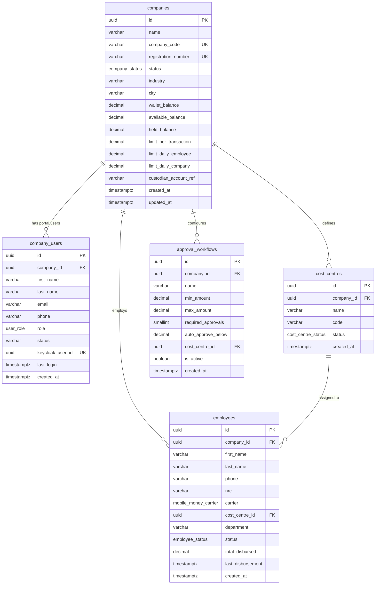
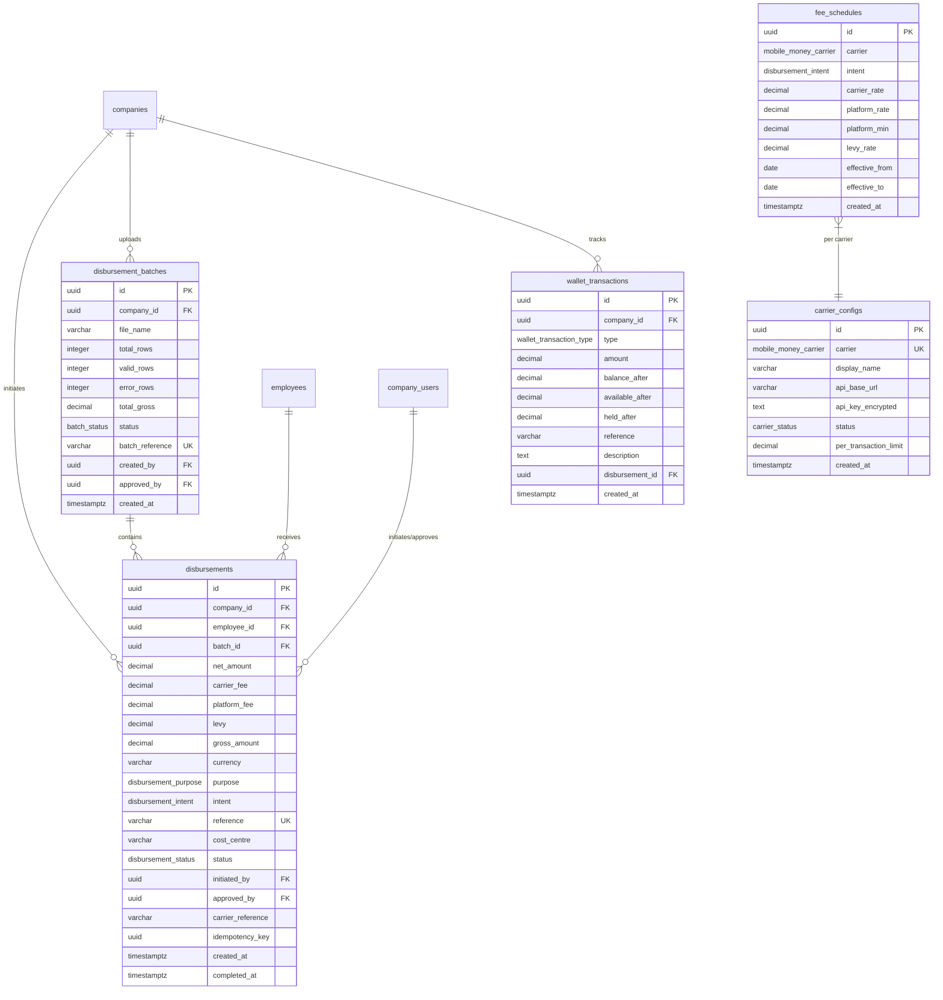
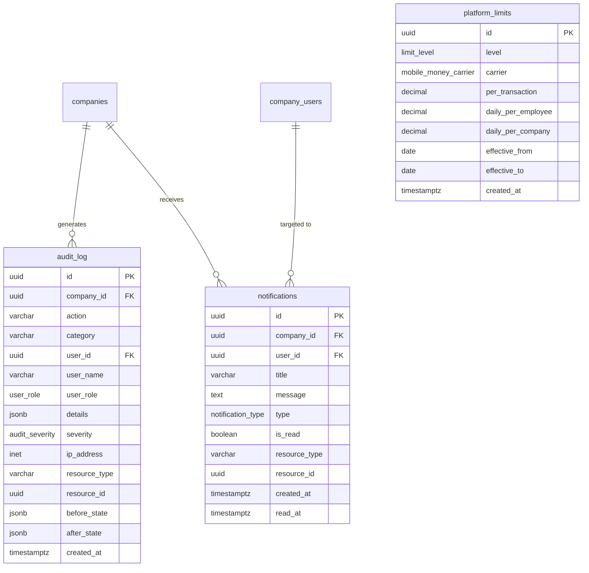

# DisbursePro Database Schema

## Complete PostgreSQL Schema Reference

| Field | Detail |
|---|---|
| **Product** | DisbursePro -- Enterprise Disbursement & Expense Management Platform |
| **Database** | PostgreSQL 16 |
| **Version** | 1.0 |
| **Date** | 2026-04-04 |
| **Target Market** | Zambia (SADC region expansion) |
| **Currency** | ZMW (Zambian Kwacha) |
| **Status** | Draft |

---

## Table of Contents

1. [Overview](#1-overview)
2. [Entity Relationship Diagrams](#2-entity-relationship-diagrams)
3. [Enum Types](#3-enum-types)
4. [Table DDL](#4-table-ddl)
5. [Indexes](#5-indexes)
6. [Row-Level Security Policies](#6-row-level-security-policies)
7. [Partitioning Strategy](#7-partitioning-strategy)
8. [Flyway Migrations](#8-flyway-migrations)
9. [Seed Data](#9-seed-data)

---

## 1. Overview

### 1.1 Database Architecture

DisbursePro uses a **single database, shared schema** multi-tenant model with PostgreSQL Row-Level Security (RLS) for hard tenant isolation. DisbursePro is an **orchestration layer** -- it does not hold customer funds, issue accounts, or act as a financial institution. Customer funds are held by a Bank of Zambia (BOZ) licensed custodian.

```
+-----------------------------------------------------------------------+
|                      PostgreSQL 16 (RDS Multi-AZ)                      |
|                                                                         |
|  +-------------------+  +-------------------+  +-------------------+   |
|  |  companies        |  |  disbursements    |  |  audit_log        |   |
|  |  company_users    |  |  disb. batches    |  |  notifications    |   |
|  |  employees        |  |  wallet_txns      |  |  platform_limits  |   |
|  |  cost_centres     |  |  fee_schedules    |  |  approval_wflows  |   |
|  |                   |  |  carrier_configs  |  |                   |   |
|  +-------------------+  +-------------------+  +-------------------+   |
|                                                                         |
|  Row-Level Security: SET app.company_id = '<uuid>'                     |
|  Platform bypass:    disbursepro_platform role (BYPASSRLS)             |
+-----------------------------------------------------------------------+
```

### 1.2 Database Roles

| Role | Privilege | Purpose |
|---|---|---|
| `disbursepro_app` | RLS-restricted, no DELETE on `audit_log` | Application connection pool (company-scoped) |
| `disbursepro_platform` | `BYPASSRLS` | Platform operator queries (cross-company dashboards) |
| `disbursepro_readonly` | `SELECT` only | Reporting, analytics, read replicas |
| `disbursepro_migrations` | `ALL` on schema | Flyway/Prisma migration runner |

### 1.3 Table Summary

| Subsystem | Tables | Description |
|---|---|---|
| Tenancy | `companies`, `company_users` | Multi-tenant companies and portal users |
| Workforce | `employees`, `cost_centres` | Employee registry and cost centre allocation |
| Disbursement | `disbursements`, `disbursement_batches` | Single and batch disbursement processing |
| Finance | `wallet_transactions`, `fee_schedules`, `platform_limits` | Wallet ledger, fee tiers, transaction limits |
| Carrier | `carrier_configs` | Mobile money carrier API configuration |
| Workflow | `approval_workflows` | Configurable approval routing rules |
| Observability | `audit_log`, `notifications` | Immutable audit trail and user notifications |

### 1.4 Conventions

- **Primary keys**: UUID v4 via `gen_random_uuid()`.
- **Money amounts**: Stored as `BIGINT` in **ngwee** (Zambian minor currency unit). ZMW 1,000.00 = `100000`. Avoids floating-point rounding. The DDL below uses `DECIMAL(15,2)` for readability in early MVP; production migration V010 converts to BIGINT.
- **Timestamps**: All `TIMESTAMPTZ` (timezone-aware), defaulting to `NOW()`.
- **Soft deletes**: No rows are physically deleted. Status columns (`active`, `suspended`, `archived`) control visibility.
- **Naming**: `snake_case` for all tables and columns. Enum type names describe their domain (e.g., `mobile_money_carrier`, `disbursement_status`).
- **Multi-tenancy**: Every tenant-scoped table has a `company_id UUID NOT NULL` column with RLS policy.
- **Idempotency**: Disbursements carry an `idempotency_key` to prevent duplicate submissions.
- **Partitioning**: High-volume tables (`disbursements`, `wallet_transactions`, `audit_log`) are range-partitioned by `created_at` (monthly).

---

## 2. Entity Relationship Diagrams

### 2.1 Core Tenancy and Workforce



### 2.2 Disbursement and Finance Subsystem



### 2.3 Observability and Platform



---

## 3. Enum Types

```sql
-- ============================================================
-- ENUM TYPES
-- All custom PostgreSQL enum types used across the schema.
-- ============================================================

-- Company lifecycle status
CREATE TYPE company_status AS ENUM ('active', 'suspended', 'pending');

-- Employee lifecycle status
CREATE TYPE employee_status AS ENUM ('active', 'inactive', 'suspended');

-- Supported mobile money carriers in Zambia
CREATE TYPE mobile_money_carrier AS ENUM ('airtel_money', 'mtn_momo', 'zamtel_kwacha');

-- Purpose classification for disbursements
CREATE TYPE disbursement_purpose AS ENUM (
    'fuel',
    'trip_allowance',
    'repairs',
    'meals',
    'advances',
    'salary',
    'supplies',
    'other'
);

-- How the recipient will use the funds
CREATE TYPE disbursement_intent AS ENUM ('withdrawal', 'purchase');

-- Disbursement processing lifecycle
CREATE TYPE disbursement_status AS ENUM (
    'draft',
    'pending_approval',
    'approved',
    'rejected',
    'processing',
    'completed',
    'failed'
);

-- Portal user roles (RBAC)
CREATE TYPE user_role AS ENUM (
    'platform_operator',
    'company_admin',
    'finance_user',
    'approver',
    'auditor'
);

-- Wallet ledger entry classification
CREATE TYPE wallet_transaction_type AS ENUM ('credit', 'debit', 'hold', 'release');

-- Audit severity levels
CREATE TYPE audit_severity AS ENUM ('info', 'warning', 'critical');

-- Audit log categories
CREATE TYPE audit_category AS ENUM (
    'auth',
    'disbursement',
    'employee',
    'wallet',
    'settings',
    'user',
    'batch',
    'company',
    'carrier',
    'compliance'
);

-- Notification display types
CREATE TYPE notification_type AS ENUM ('success', 'error', 'warning', 'info');

-- CSV/Excel batch upload lifecycle
CREATE TYPE batch_status AS ENUM (
    'validating',
    'validated',
    'pending_approval',
    'approved',
    'processing',
    'completed',
    'partially_completed',
    'failed',
    'rejected'
);

-- Approval decision actions
CREATE TYPE approval_action AS ENUM ('approve', 'reject', 'escalate', 'return');

-- Carrier health status
CREATE TYPE carrier_status AS ENUM ('operational', 'degraded', 'down');

-- Cost centre lifecycle
CREATE TYPE cost_centre_status AS ENUM ('active', 'archived');

-- Platform limit scoping level
CREATE TYPE limit_level AS ENUM ('network', 'platform', 'company');
```

---

## 4. Table DDL

### 4.1 companies

```sql
-- ============================================================
-- COMPANIES
-- Multi-tenant root entity. Every company has an isolated wallet
-- held by a BOZ-licensed custodian. Wallet columns are denormalized
-- from the custodian API for query performance.
-- ============================================================
CREATE TABLE companies (
    id                      UUID PRIMARY KEY DEFAULT gen_random_uuid(),
    name                    VARCHAR(200) NOT NULL,
    company_code            VARCHAR(6) NOT NULL UNIQUE,        -- Login scoping (e.g., "CPTRAN")
    registration_number     VARCHAR(50) NOT NULL UNIQUE,       -- PACRA registration number
    status                  company_status NOT NULL DEFAULT 'pending',
    industry                VARCHAR(100) NOT NULL,
    city                    VARCHAR(100) NOT NULL,
    address                 TEXT,
    phone                   VARCHAR(20),
    email                   VARCHAR(255),

    -- Wallet (denormalized from custodian for performance)
    wallet_balance          DECIMAL(15,2) NOT NULL DEFAULT 0.00,
    available_balance       DECIMAL(15,2) NOT NULL DEFAULT 0.00,
    held_balance            DECIMAL(15,2) NOT NULL DEFAULT 0.00,

    -- Aggregates (updated via triggers/jobs)
    total_users             INTEGER NOT NULL DEFAULT 0,
    total_employees         INTEGER NOT NULL DEFAULT 0,
    monthly_volume          DECIMAL(15,2) NOT NULL DEFAULT 0.00,
    last_funded             TIMESTAMPTZ,

    -- Limits (company-level, must be <= platform limits)
    limit_per_transaction   DECIMAL(15,2) DEFAULT 5000.00,
    limit_daily_employee    DECIMAL(15,2) DEFAULT 8000.00,
    limit_daily_company     DECIMAL(15,2) DEFAULT 500000.00,

    -- Metadata
    custodian_account_ref   VARCHAR(100),                      -- Custodian's reference for this company wallet
    created_at              TIMESTAMPTZ NOT NULL DEFAULT NOW(),
    updated_at              TIMESTAMPTZ NOT NULL DEFAULT NOW(),

    CONSTRAINT chk_balance_non_negative CHECK (wallet_balance >= 0),
    CONSTRAINT chk_available_non_negative CHECK (available_balance >= 0),
    CONSTRAINT chk_held_non_negative CHECK (held_balance >= 0),
    CONSTRAINT chk_balance_consistency CHECK (wallet_balance = available_balance + held_balance),
    CONSTRAINT chk_company_code_format CHECK (company_code ~ '^[A-Z0-9]{6}$')
);

COMMENT ON TABLE companies IS 'Multi-tenant root entity. Each company has an isolated custodian wallet.';
COMMENT ON COLUMN companies.company_code IS 'Six-character alphanumeric code used for login scoping.';
COMMENT ON COLUMN companies.wallet_balance IS 'Total wallet balance in ZMW. Denormalized from custodian.';
COMMENT ON COLUMN companies.available_balance IS 'Funds available for new disbursements (total minus held).';
COMMENT ON COLUMN companies.held_balance IS 'Funds held for pending/processing disbursements.';
COMMENT ON COLUMN companies.custodian_account_ref IS 'External reference ID at the BOZ-licensed custodian.';
```

### 4.2 company_users

```sql
-- ============================================================
-- COMPANY USERS
-- Portal users who log in via Keycloak. Scoped to a single company.
-- Roles: company_admin, finance_user, approver, auditor.
-- Platform operators are also stored here with role = platform_operator.
-- ============================================================
CREATE TABLE company_users (
    id                      UUID PRIMARY KEY DEFAULT gen_random_uuid(),
    company_id              UUID NOT NULL REFERENCES companies(id) ON DELETE CASCADE,
    first_name              VARCHAR(100) NOT NULL,
    last_name               VARCHAR(100) NOT NULL,
    email                   VARCHAR(255) NOT NULL,
    phone                   VARCHAR(20) NOT NULL,
    role                    user_role NOT NULL,
    status                  VARCHAR(20) NOT NULL DEFAULT 'active',
    keycloak_user_id        UUID UNIQUE,                       -- FK to Keycloak user store
    last_login              TIMESTAMPTZ,
    created_at              TIMESTAMPTZ NOT NULL DEFAULT NOW(),
    updated_at              TIMESTAMPTZ NOT NULL DEFAULT NOW(),

    CONSTRAINT uq_company_user_email UNIQUE (company_id, email),
    CONSTRAINT chk_phone_format CHECK (phone ~ '^\+260\d{9}$'),
    CONSTRAINT chk_user_status CHECK (status IN ('active', 'inactive'))
);

COMMENT ON TABLE company_users IS 'Portal users authenticated via Keycloak. Each belongs to exactly one company.';
COMMENT ON COLUMN company_users.phone IS 'Zambian mobile number in E.164 format (+260XXXXXXXXX).';
COMMENT ON COLUMN company_users.keycloak_user_id IS 'Maps to Keycloak user for SSO/RBAC federation.';
```

### 4.3 employees

```sql
-- ============================================================
-- EMPLOYEES
-- Disbursement recipients. Each employee has a single mobile money
-- wallet identified by phone + carrier. NRC (National Registration
-- Card) is validated for KYC compliance.
-- ============================================================
CREATE TABLE employees (
    id                      UUID PRIMARY KEY DEFAULT gen_random_uuid(),
    company_id              UUID NOT NULL REFERENCES companies(id) ON DELETE CASCADE,
    first_name              VARCHAR(100) NOT NULL,
    last_name               VARCHAR(100) NOT NULL,
    phone                   VARCHAR(20) NOT NULL,
    nrc                     VARCHAR(15) NOT NULL,               -- National Registration Card (XXXXXX/XX/X)
    carrier                 mobile_money_carrier NOT NULL,
    cost_centre_id          UUID REFERENCES cost_centres(id),
    cost_centre             VARCHAR(100) NOT NULL,              -- Denormalized for query performance
    department              VARCHAR(100) NOT NULL,
    status                  employee_status NOT NULL DEFAULT 'active',

    -- Aggregates (updated via triggers/jobs)
    total_disbursed         DECIMAL(15,2) NOT NULL DEFAULT 0.00,
    last_disbursement       TIMESTAMPTZ,
    disbursement_count      INTEGER NOT NULL DEFAULT 0,

    created_at              TIMESTAMPTZ NOT NULL DEFAULT NOW(),
    updated_at              TIMESTAMPTZ NOT NULL DEFAULT NOW(),

    CONSTRAINT uq_company_employee_phone UNIQUE (company_id, phone),
    CONSTRAINT uq_company_employee_nrc UNIQUE (company_id, nrc),
    CONSTRAINT chk_phone_format CHECK (phone ~ '^\+260\d{9}$'),
    CONSTRAINT chk_nrc_format CHECK (nrc ~ '^\d{6}/\d{2}/\d{1}$')
);

COMMENT ON TABLE employees IS 'Disbursement recipients registered under a company.';
COMMENT ON COLUMN employees.nrc IS 'Zambian National Registration Card number (format: XXXXXX/XX/X).';
COMMENT ON COLUMN employees.carrier IS 'Mobile money carrier for this employee wallet.';
COMMENT ON COLUMN employees.cost_centre IS 'Denormalized cost centre name for fast filtering.';
```

### 4.4 cost_centres

```sql
-- ============================================================
-- COST CENTRES
-- Organizational units within a company used to categorize
-- disbursements (e.g., "Northern Route", "Lusaka Depot").
-- ============================================================
CREATE TABLE cost_centres (
    id                      UUID PRIMARY KEY DEFAULT gen_random_uuid(),
    company_id              UUID NOT NULL REFERENCES companies(id) ON DELETE CASCADE,
    name                    VARCHAR(100) NOT NULL,
    code                    VARCHAR(20) NOT NULL,               -- Short code (e.g., "NR" for Northern Route)
    status                  cost_centre_status NOT NULL DEFAULT 'active',
    created_at              TIMESTAMPTZ NOT NULL DEFAULT NOW(),
    updated_at              TIMESTAMPTZ NOT NULL DEFAULT NOW(),

    CONSTRAINT uq_cost_centre_name UNIQUE (company_id, name),
    CONSTRAINT uq_cost_centre_code UNIQUE (company_id, code)
);

COMMENT ON TABLE cost_centres IS 'Organizational units for disbursement categorization and budget tracking.';
COMMENT ON COLUMN cost_centres.code IS 'Short alphanumeric code displayed in references (e.g., NR, LD).';
```

### 4.5 disbursements

```sql
-- ============================================================
-- DISBURSEMENTS (Partitioned)
-- Core transaction table. Each row represents a single mobile money
-- disbursement to an employee. Partitioned by created_at (monthly).
-- ============================================================
CREATE TABLE disbursements (
    id                      UUID PRIMARY KEY DEFAULT gen_random_uuid(),
    company_id              UUID NOT NULL REFERENCES companies(id),
    employee_id             UUID NOT NULL REFERENCES employees(id),
    batch_id                UUID REFERENCES disbursement_batches(id),

    -- Amounts (ZMW)
    net_amount              DECIMAL(15,2) NOT NULL,
    carrier_fee             DECIMAL(15,2) NOT NULL,
    platform_fee            DECIMAL(15,2) NOT NULL,
    levy                    DECIMAL(15,2) NOT NULL DEFAULT 0.00,
    gross_amount            DECIMAL(15,2) NOT NULL,
    currency                VARCHAR(3) NOT NULL DEFAULT 'ZMW',

    -- Classification
    purpose                 disbursement_purpose NOT NULL,
    intent                  disbursement_intent NOT NULL,
    reference               VARCHAR(50) NOT NULL UNIQUE,        -- Auto-generated: TRIP-NR-20260403-001
    cost_centre             VARCHAR(100) NOT NULL,
    notes                   VARCHAR(200),

    -- Status
    status                  disbursement_status NOT NULL DEFAULT 'draft',

    -- Actors
    initiated_by            UUID NOT NULL REFERENCES company_users(id),
    approved_by             UUID REFERENCES company_users(id),
    approver_comment        TEXT,

    -- Timestamps
    created_at              TIMESTAMPTZ NOT NULL DEFAULT NOW(),
    submitted_at            TIMESTAMPTZ,
    approved_at             TIMESTAMPTZ,
    processing_at           TIMESTAMPTZ,
    completed_at            TIMESTAMPTZ,
    failed_at               TIMESTAMPTZ,

    -- Carrier response
    carrier_reference       VARCHAR(100),                       -- Carrier's transaction ID
    carrier_status_message  TEXT,                                -- Carrier's status message
    failure_reason          TEXT,
    retry_count             SMALLINT NOT NULL DEFAULT 0,

    -- Fee rates at time of creation (for historical accuracy)
    carrier_rate_applied    DECIMAL(5,4) NOT NULL,
    platform_rate_applied   DECIMAL(5,4) NOT NULL,
    levy_rate_applied       DECIMAL(5,4) NOT NULL DEFAULT 0.0000,

    -- Idempotency
    idempotency_key         UUID,

    CONSTRAINT chk_net_amount_positive CHECK (net_amount > 0),
    CONSTRAINT chk_gross_equals_components CHECK (
        gross_amount = net_amount + carrier_fee + platform_fee + levy
    ),
    CONSTRAINT chk_initiator_not_approver CHECK (initiated_by != approved_by)
) PARTITION BY RANGE (created_at);

COMMENT ON TABLE disbursements IS 'Core disbursement records. Partitioned monthly by created_at.';
COMMENT ON COLUMN disbursements.reference IS 'Human-readable ref: PURPOSE-COSTCENTRE-YYYYMMDD-SEQ.';
COMMENT ON COLUMN disbursements.carrier_rate_applied IS 'Snapshot of carrier fee rate at creation time.';
COMMENT ON COLUMN disbursements.idempotency_key IS 'Client-generated UUID to prevent duplicate submissions.';
```

### 4.6 disbursement_batches

```sql
-- ============================================================
-- DISBURSEMENT BATCHES
-- CSV/Excel bulk uploads. Each batch produces N disbursement rows
-- after validation. Approval is at the batch level.
-- ============================================================
CREATE TABLE disbursement_batches (
    id                      UUID PRIMARY KEY DEFAULT gen_random_uuid(),
    company_id              UUID NOT NULL REFERENCES companies(id),
    file_name               VARCHAR(255) NOT NULL,
    file_path               VARCHAR(500),                       -- S3 key
    total_rows              INTEGER NOT NULL,
    valid_rows              INTEGER NOT NULL,
    error_rows              INTEGER NOT NULL DEFAULT 0,
    total_net               DECIMAL(15,2) NOT NULL,
    total_carrier_fees      DECIMAL(15,2) NOT NULL,
    total_platform_fees     DECIMAL(15,2) NOT NULL,
    total_levies            DECIMAL(15,2) NOT NULL DEFAULT 0.00,
    total_gross             DECIMAL(15,2) NOT NULL,
    status                  batch_status NOT NULL DEFAULT 'validating',
    batch_reference         VARCHAR(50) NOT NULL UNIQUE,        -- BATCH-YYYYMMDD-SEQ
    created_by              UUID NOT NULL REFERENCES company_users(id),
    approved_by             UUID REFERENCES company_users(id),
    approved_at             TIMESTAMPTZ,

    -- Processing progress
    items_completed         INTEGER NOT NULL DEFAULT 0,
    items_failed            INTEGER NOT NULL DEFAULT 0,
    items_processing        INTEGER NOT NULL DEFAULT 0,

    created_at              TIMESTAMPTZ NOT NULL DEFAULT NOW(),
    completed_at            TIMESTAMPTZ,

    CONSTRAINT chk_rows_consistency CHECK (total_rows = valid_rows + error_rows)
);

COMMENT ON TABLE disbursement_batches IS 'Bulk upload batches containing multiple disbursements.';
COMMENT ON COLUMN disbursement_batches.file_path IS 'S3 object key for the uploaded CSV/Excel file.';
COMMENT ON COLUMN disbursement_batches.batch_reference IS 'Auto-generated: BATCH-YYYYMMDD-SEQ.';
```

### 4.7 wallet_transactions

```sql
-- ============================================================
-- WALLET TRANSACTIONS (Partitioned)
-- Immutable ledger of all wallet balance changes. Every credit,
-- debit, hold, and release is recorded with balance snapshots.
-- Partitioned by created_at (monthly).
-- ============================================================
CREATE TABLE wallet_transactions (
    id                      UUID PRIMARY KEY DEFAULT gen_random_uuid(),
    company_id              UUID NOT NULL REFERENCES companies(id),
    type                    wallet_transaction_type NOT NULL,
    amount                  DECIMAL(15,2) NOT NULL,
    balance_after           DECIMAL(15,2) NOT NULL,
    available_after         DECIMAL(15,2) NOT NULL,
    held_after              DECIMAL(15,2) NOT NULL,
    reference               VARCHAR(100) NOT NULL,              -- Disbursement ID, bank ref, etc.
    description             TEXT NOT NULL,
    disbursement_id         UUID REFERENCES disbursements(id),
    created_by              UUID REFERENCES company_users(id),
    created_at              TIMESTAMPTZ NOT NULL DEFAULT NOW(),

    CONSTRAINT chk_amount_positive CHECK (amount > 0)
) PARTITION BY RANGE (created_at);

COMMENT ON TABLE wallet_transactions IS 'Immutable wallet ledger. Every balance mutation is recorded.';
COMMENT ON COLUMN wallet_transactions.balance_after IS 'Total wallet balance after this transaction.';
COMMENT ON COLUMN wallet_transactions.available_after IS 'Available balance after this transaction.';
```

### 4.8 fee_schedules

```sql
-- ============================================================
-- FEE SCHEDULES
-- Fee rates per carrier and intent. Only one active schedule per
-- (carrier, intent) pair at a time (effective_to IS NULL = active).
-- Historical rates are preserved for auditing.
-- ============================================================
CREATE TABLE fee_schedules (
    id                      UUID PRIMARY KEY DEFAULT gen_random_uuid(),
    carrier                 mobile_money_carrier NOT NULL,
    intent                  disbursement_intent NOT NULL,
    carrier_rate            DECIMAL(5,4) NOT NULL,              -- e.g., 0.0250 = 2.5%
    platform_rate           DECIMAL(5,4) NOT NULL,              -- e.g., 0.0100 = 1.0%
    platform_min            DECIMAL(15,2) NOT NULL,             -- e.g., 2.00 = ZMW 2 minimum
    levy_rate               DECIMAL(5,4) NOT NULL DEFAULT 0.0000,
    effective_from          DATE NOT NULL,
    effective_to            DATE,                                -- NULL = currently active
    created_by              UUID,
    created_at              TIMESTAMPTZ NOT NULL DEFAULT NOW(),

    CONSTRAINT uq_fee_schedule UNIQUE (carrier, intent, effective_from),
    CONSTRAINT chk_rates_non_negative CHECK (
        carrier_rate >= 0 AND platform_rate >= 0 AND levy_rate >= 0
    ),
    CONSTRAINT chk_date_range CHECK (effective_to IS NULL OR effective_to > effective_from)
);

COMMENT ON TABLE fee_schedules IS 'Fee rate schedules per carrier and intent. NULL effective_to means currently active.';
COMMENT ON COLUMN fee_schedules.carrier_rate IS 'Carrier fee as a decimal fraction (0.0250 = 2.5%).';
COMMENT ON COLUMN fee_schedules.platform_min IS 'Minimum platform fee in ZMW (floor for percentage calc).';
```

### 4.9 carrier_configs

```sql
-- ============================================================
-- CARRIER CONFIGURATIONS
-- API credentials and health metrics for each mobile money carrier.
-- Credentials are encrypted at rest via AWS KMS.
-- ============================================================
CREATE TABLE carrier_configs (
    id                      UUID PRIMARY KEY DEFAULT gen_random_uuid(),
    carrier                 mobile_money_carrier NOT NULL UNIQUE,
    display_name            VARCHAR(100) NOT NULL,
    api_base_url            VARCHAR(500) NOT NULL,
    api_key_encrypted       TEXT NOT NULL,                      -- Encrypted with AWS KMS
    api_secret_encrypted    TEXT,
    subscription_key        VARCHAR(255),                       -- MTN specific
    auth_type               VARCHAR(20) NOT NULL,               -- 'oauth2', 'api_key', 'basic'
    status                  carrier_status NOT NULL DEFAULT 'operational',
    webhook_url             VARCHAR(500),
    webhook_secret          TEXT,

    -- Limits (network-level)
    per_transaction_limit   DECIMAL(15,2) NOT NULL DEFAULT 10000.00,
    daily_limit             DECIMAL(15,2),

    -- Health metrics
    success_rate_24h        DECIMAL(5,2),                       -- Last 24h success rate
    avg_response_time_ms    INTEGER,                            -- Average API response time
    last_health_check       TIMESTAMPTZ,
    last_successful_txn     TIMESTAMPTZ,

    created_at              TIMESTAMPTZ NOT NULL DEFAULT NOW(),
    updated_at              TIMESTAMPTZ NOT NULL DEFAULT NOW()
);

COMMENT ON TABLE carrier_configs IS 'Mobile money carrier API configuration and health metrics.';
COMMENT ON COLUMN carrier_configs.api_key_encrypted IS 'AES-256 encrypted via AWS KMS. Never stored in plaintext.';
COMMENT ON COLUMN carrier_configs.success_rate_24h IS 'Rolling 24-hour success rate updated by health check job.';
```

### 4.10 approval_workflows

```sql
-- ============================================================
-- APPROVAL WORKFLOWS
-- Configurable rules that determine how many approvals are required
-- for disbursements within a given amount range and/or cost centre.
-- ============================================================
CREATE TABLE approval_workflows (
    id                      UUID PRIMARY KEY DEFAULT gen_random_uuid(),
    company_id              UUID NOT NULL REFERENCES companies(id) ON DELETE CASCADE,
    name                    VARCHAR(100) NOT NULL,
    min_amount              DECIMAL(15,2),                      -- Apply this rule for amounts >= min
    max_amount              DECIMAL(15,2),                      -- Apply this rule for amounts <= max
    required_approvals      SMALLINT NOT NULL DEFAULT 1,        -- Number of approvals required
    auto_approve_below      DECIMAL(15,2),                      -- Auto-approve if amount < this (Phase 2)
    cost_centre_id          UUID REFERENCES cost_centres(id),   -- Scope to specific cost centre
    is_active               BOOLEAN NOT NULL DEFAULT TRUE,
    created_at              TIMESTAMPTZ NOT NULL DEFAULT NOW(),
    updated_at              TIMESTAMPTZ NOT NULL DEFAULT NOW(),

    CONSTRAINT chk_amount_range CHECK (min_amount IS NULL OR max_amount IS NULL OR min_amount <= max_amount)
);

COMMENT ON TABLE approval_workflows IS 'Rules defining approval requirements per amount range and cost centre.';
COMMENT ON COLUMN approval_workflows.auto_approve_below IS 'Phase 2: disbursements below this amount skip approval.';
```

### 4.11 audit_log

```sql
-- ============================================================
-- AUDIT LOG (Partitioned, Immutable)
-- Every significant action is recorded. UPDATE and DELETE are revoked
-- from application roles. 7-year retention per BOZ requirements.
-- Partitioned by created_at (monthly).
-- ============================================================
CREATE TABLE audit_log (
    id                      UUID PRIMARY KEY DEFAULT gen_random_uuid(),
    company_id              UUID,                               -- NULL for platform-level actions
    action                  VARCHAR(100) NOT NULL,
    category                VARCHAR(50) NOT NULL,               -- auth, disbursement, employee, wallet, settings, user
    user_id                 UUID,
    user_name               VARCHAR(200) NOT NULL,
    user_role               user_role NOT NULL,
    details                 JSONB NOT NULL,                     -- Structured action details
    severity                audit_severity NOT NULL DEFAULT 'info',
    ip_address              INET,
    user_agent              TEXT,
    resource_type           VARCHAR(50),                        -- disbursement, employee, company, etc.
    resource_id             UUID,                               -- ID of affected resource
    before_state            JSONB,                              -- State before action (for updates)
    after_state             JSONB,                              -- State after action (for updates)
    created_at              TIMESTAMPTZ NOT NULL DEFAULT NOW()
) PARTITION BY RANGE (created_at);

-- IMMUTABILITY: Revoke UPDATE and DELETE from all application roles
REVOKE UPDATE, DELETE ON audit_log FROM disbursepro_app;

COMMENT ON TABLE audit_log IS 'Immutable audit trail. 7-year retention per BOZ regulations. Partitioned monthly.';
COMMENT ON COLUMN audit_log.before_state IS 'JSON snapshot of entity state before mutation (for change tracking).';
COMMENT ON COLUMN audit_log.after_state IS 'JSON snapshot of entity state after mutation (for change tracking).';
```

### 4.12 notifications

```sql
-- ============================================================
-- NOTIFICATIONS
-- In-app notifications for portal users. Tracks read status.
-- ============================================================
CREATE TABLE notifications (
    id                      UUID PRIMARY KEY DEFAULT gen_random_uuid(),
    company_id              UUID REFERENCES companies(id),
    user_id                 UUID REFERENCES company_users(id),
    title                   VARCHAR(200) NOT NULL,
    message                 TEXT NOT NULL,
    type                    notification_type NOT NULL DEFAULT 'info',
    is_read                 BOOLEAN NOT NULL DEFAULT FALSE,
    resource_type           VARCHAR(50),
    resource_id             UUID,
    created_at              TIMESTAMPTZ NOT NULL DEFAULT NOW(),
    read_at                 TIMESTAMPTZ
);

COMMENT ON TABLE notifications IS 'In-app notification inbox for portal users.';
COMMENT ON COLUMN notifications.resource_type IS 'Entity type this notification references (e.g., disbursement, batch).';
```

### 4.13 platform_limits

```sql
-- ============================================================
-- PLATFORM LIMITS
-- Transaction limits at three levels: network (carrier-imposed),
-- platform (operator-configured), and company (per-tenant overrides).
-- ============================================================
CREATE TABLE platform_limits (
    id                      UUID PRIMARY KEY DEFAULT gen_random_uuid(),
    level                   limit_level NOT NULL,
    carrier                 mobile_money_carrier,               -- NULL for platform-wide limits
    per_transaction         DECIMAL(15,2) NOT NULL,
    daily_per_employee      DECIMAL(15,2),
    daily_per_company       DECIMAL(15,2),
    effective_from          DATE NOT NULL,
    effective_to            DATE,
    created_by              UUID,
    created_at              TIMESTAMPTZ NOT NULL DEFAULT NOW(),

    CONSTRAINT chk_effective_dates CHECK (effective_to IS NULL OR effective_to > effective_from)
);

COMMENT ON TABLE platform_limits IS 'Transaction limits at network, platform, and company levels.';
COMMENT ON COLUMN platform_limits.level IS 'network = carrier-imposed, platform = operator-set, company = tenant override.';
```

---

## 5. Indexes

All indexes are defined alongside their tables above. This section provides a consolidated reference.

### 5.1 Primary Key and Unique Indexes (Automatic)

Every `PRIMARY KEY` and `UNIQUE` constraint automatically creates a B-tree index. These are not listed again below.

### 5.2 Foreign Key Indexes

```sql
-- companies: no FK columns (root entity)
-- company_users
CREATE INDEX idx_company_users_company ON company_users(company_id);
CREATE INDEX idx_company_users_keycloak ON company_users(keycloak_user_id);

-- employees
CREATE INDEX idx_employees_company ON employees(company_id);
CREATE INDEX idx_employees_phone ON employees(phone);

-- cost_centres
CREATE INDEX idx_cost_centres_company ON cost_centres(company_id);

-- disbursements
CREATE INDEX idx_disbursements_employee ON disbursements(employee_id, created_at DESC);
CREATE INDEX idx_disbursements_batch ON disbursements(batch_id) WHERE batch_id IS NOT NULL;

-- disbursement_batches
CREATE INDEX idx_batches_company ON disbursement_batches(company_id, created_at DESC);

-- wallet_transactions
CREATE INDEX idx_wallet_txn_disbursement ON wallet_transactions(disbursement_id)
    WHERE disbursement_id IS NOT NULL;

-- approval_workflows
CREATE INDEX idx_approval_workflows_company ON approval_workflows(company_id);

-- notifications
CREATE INDEX idx_notifications_user ON notifications(user_id, is_read, created_at DESC);

-- audit_log
CREATE INDEX idx_audit_user ON audit_log(user_id, created_at DESC);
CREATE INDEX idx_audit_resource ON audit_log(resource_type, resource_id);
```

### 5.3 Status and Filter Indexes

```sql
-- companies
CREATE INDEX idx_companies_code ON companies(company_code);
CREATE INDEX idx_companies_status ON companies(status);
CREATE INDEX idx_companies_registration ON companies(registration_number);

-- company_users
CREATE INDEX idx_company_users_role ON company_users(company_id, role);

-- employees
CREATE INDEX idx_employees_carrier ON employees(company_id, carrier);
CREATE INDEX idx_employees_cost_centre ON employees(company_id, cost_centre);
CREATE INDEX idx_employees_status ON employees(company_id, status);

-- disbursements
CREATE INDEX idx_disbursements_status ON disbursements(company_id, status);
CREATE INDEX idx_disbursements_pending ON disbursements(company_id, status)
    WHERE status = 'pending_approval';
CREATE INDEX idx_disbursements_reference ON disbursements(reference);
CREATE INDEX idx_disbursements_carrier_ref ON disbursements(carrier_reference)
    WHERE carrier_reference IS NOT NULL;
CREATE INDEX idx_disbursements_idempotency ON disbursements(idempotency_key)
    WHERE idempotency_key IS NOT NULL;

-- disbursement_batches
CREATE INDEX idx_batches_status ON disbursement_batches(company_id, status);

-- wallet_transactions
CREATE INDEX idx_wallet_txn_type ON wallet_transactions(company_id, type);

-- fee_schedules
CREATE INDEX idx_fee_schedules_active ON fee_schedules(carrier, intent)
    WHERE effective_to IS NULL;

-- platform_limits
CREATE INDEX idx_platform_limits_active ON platform_limits(level, carrier)
    WHERE effective_to IS NULL;

-- audit_log
CREATE INDEX idx_audit_severity ON audit_log(severity, created_at DESC)
    WHERE severity IN ('warning', 'critical');
```

### 5.4 Composite Indexes for Common Queries

```sql
-- Company dashboard: recent disbursements
CREATE INDEX idx_disbursements_company_date ON disbursements(company_id, created_at DESC);

-- Wallet statement view
CREATE INDEX idx_wallet_txn_company_date ON wallet_transactions(company_id, created_at DESC);

-- Audit log browsing
CREATE INDEX idx_audit_company_date ON audit_log(company_id, created_at DESC);
CREATE INDEX idx_audit_category ON audit_log(category, created_at DESC);

-- Employee search (trigram for LIKE/ILIKE queries)
CREATE EXTENSION IF NOT EXISTS pg_trgm;
CREATE INDEX idx_employees_search ON employees USING gin(
    (first_name || ' ' || last_name) gin_trgm_ops
);
```

---

## 6. Row-Level Security Policies

### 6.1 Enable RLS on All Tenant-Scoped Tables

```sql
-- Enable RLS on every table that contains company_id
ALTER TABLE company_users ENABLE ROW LEVEL SECURITY;
ALTER TABLE employees ENABLE ROW LEVEL SECURITY;
ALTER TABLE cost_centres ENABLE ROW LEVEL SECURITY;
ALTER TABLE disbursements ENABLE ROW LEVEL SECURITY;
ALTER TABLE disbursement_batches ENABLE ROW LEVEL SECURITY;
ALTER TABLE wallet_transactions ENABLE ROW LEVEL SECURITY;
ALTER TABLE approval_workflows ENABLE ROW LEVEL SECURITY;
ALTER TABLE audit_log ENABLE ROW LEVEL SECURITY;
ALTER TABLE notifications ENABLE ROW LEVEL SECURITY;
```

### 6.2 Tenant Isolation Policies

Each policy restricts rows to the company identified by the session variable `app.company_id`. The application sets this variable on every connection checkout from the pool:

```sql
SET app.company_id = '<company-uuid>';
```

```sql
-- Standard tenant isolation (applied to most tables)
CREATE POLICY tenant_isolation ON company_users
    USING (company_id = current_setting('app.company_id', true)::UUID);

CREATE POLICY tenant_isolation ON employees
    USING (company_id = current_setting('app.company_id', true)::UUID);

CREATE POLICY tenant_isolation ON cost_centres
    USING (company_id = current_setting('app.company_id', true)::UUID);

CREATE POLICY tenant_isolation ON disbursements
    USING (company_id = current_setting('app.company_id', true)::UUID);

CREATE POLICY tenant_isolation ON disbursement_batches
    USING (company_id = current_setting('app.company_id', true)::UUID);

CREATE POLICY tenant_isolation ON wallet_transactions
    USING (company_id = current_setting('app.company_id', true)::UUID);

CREATE POLICY tenant_isolation ON approval_workflows
    USING (company_id = current_setting('app.company_id', true)::UUID);

CREATE POLICY tenant_isolation ON notifications
    USING (company_id = current_setting('app.company_id', true)::UUID);
```

### 6.3 Audit Log Special Policy

The audit log allows platform-level entries (where `company_id IS NULL`) to be visible to platform operators:

```sql
CREATE POLICY tenant_isolation ON audit_log
    USING (
        company_id IS NULL  -- Platform-level actions visible to platform operators
        OR company_id = current_setting('app.company_id', true)::UUID
    );
```

### 6.4 Platform Operator Bypass

Platform operators use the `disbursepro_platform` database role which has `BYPASSRLS` privilege, enabling cross-company queries for the platform dashboard and company management views:

```sql
-- Grant BYPASSRLS to the platform role
ALTER ROLE disbursepro_platform BYPASSRLS;

-- The application backend switches to this role for platform operator sessions:
-- SET ROLE disbursepro_platform;
```

---

## 7. Partitioning Strategy

### 7.1 Partitioned Tables

Three high-volume tables are range-partitioned by `created_at` on a monthly basis:

| Table | Partition Key | Retention | Estimated Rows/Month |
|---|---|---|---|
| `disbursements` | `created_at` | Indefinite | 10,000 -- 100,000 |
| `wallet_transactions` | `created_at` | Indefinite | 20,000 -- 200,000 |
| `audit_log` | `created_at` | 7 years (BOZ) | 50,000 -- 500,000 |

### 7.2 Partition Creation

Initial partitions for H1 2026:

```sql
-- disbursements partitions
CREATE TABLE disbursements_2026_01 PARTITION OF disbursements
    FOR VALUES FROM ('2026-01-01') TO ('2026-02-01');
CREATE TABLE disbursements_2026_02 PARTITION OF disbursements
    FOR VALUES FROM ('2026-02-01') TO ('2026-03-01');
CREATE TABLE disbursements_2026_03 PARTITION OF disbursements
    FOR VALUES FROM ('2026-03-01') TO ('2026-04-01');
CREATE TABLE disbursements_2026_04 PARTITION OF disbursements
    FOR VALUES FROM ('2026-04-01') TO ('2026-05-01');
CREATE TABLE disbursements_2026_05 PARTITION OF disbursements
    FOR VALUES FROM ('2026-05-01') TO ('2026-06-01');
CREATE TABLE disbursements_2026_06 PARTITION OF disbursements
    FOR VALUES FROM ('2026-06-01') TO ('2026-07-01');

-- wallet_transactions partitions
CREATE TABLE wallet_transactions_2026_01 PARTITION OF wallet_transactions
    FOR VALUES FROM ('2026-01-01') TO ('2026-02-01');
CREATE TABLE wallet_transactions_2026_02 PARTITION OF wallet_transactions
    FOR VALUES FROM ('2026-02-01') TO ('2026-03-01');
CREATE TABLE wallet_transactions_2026_03 PARTITION OF wallet_transactions
    FOR VALUES FROM ('2026-03-01') TO ('2026-04-01');
CREATE TABLE wallet_transactions_2026_04 PARTITION OF wallet_transactions
    FOR VALUES FROM ('2026-04-01') TO ('2026-05-01');
CREATE TABLE wallet_transactions_2026_05 PARTITION OF wallet_transactions
    FOR VALUES FROM ('2026-05-01') TO ('2026-06-01');
CREATE TABLE wallet_transactions_2026_06 PARTITION OF wallet_transactions
    FOR VALUES FROM ('2026-06-01') TO ('2026-07-01');

-- audit_log partitions
CREATE TABLE audit_log_2026_01 PARTITION OF audit_log
    FOR VALUES FROM ('2026-01-01') TO ('2026-02-01');
CREATE TABLE audit_log_2026_02 PARTITION OF audit_log
    FOR VALUES FROM ('2026-02-01') TO ('2026-03-01');
CREATE TABLE audit_log_2026_03 PARTITION OF audit_log
    FOR VALUES FROM ('2026-03-01') TO ('2026-04-01');
CREATE TABLE audit_log_2026_04 PARTITION OF audit_log
    FOR VALUES FROM ('2026-04-01') TO ('2026-05-01');
CREATE TABLE audit_log_2026_05 PARTITION OF audit_log
    FOR VALUES FROM ('2026-05-01') TO ('2026-06-01');
CREATE TABLE audit_log_2026_06 PARTITION OF audit_log
    FOR VALUES FROM ('2026-06-01') TO ('2026-07-01');
```

### 7.3 Automatic Partition Management

Use `pg_partman` to auto-create future partitions:

```sql
-- Install pg_partman extension
CREATE EXTENSION IF NOT EXISTS pg_partman;

-- Configure auto-creation (3 months ahead)
SELECT partman.create_parent(
    p_parent_table := 'public.disbursements',
    p_control := 'created_at',
    p_type := 'range',
    p_interval := '1 month',
    p_premake := 3
);

SELECT partman.create_parent(
    p_parent_table := 'public.wallet_transactions',
    p_control := 'created_at',
    p_type := 'range',
    p_interval := '1 month',
    p_premake := 3
);

SELECT partman.create_parent(
    p_parent_table := 'public.audit_log',
    p_control := 'created_at',
    p_type := 'range',
    p_interval := '1 month',
    p_premake := 3
);
```

---

## 8. Flyway Migrations

### 8.1 Migration Manifest

| Version | Description | Dependencies |
|---|---|---|
| V001 | Create enum types | -- |
| V002 | Create companies table | V001 |
| V003 | Create company_users table | V002 |
| V004 | Create cost_centres table | V002 |
| V005 | Create employees table | V002, V004 |
| V006 | Create fee_schedules table | V001 |
| V007 | Create carrier_configs table | V001 |
| V008 | Create disbursement_batches table | V002, V003 |
| V009 | Create disbursements table (partitioned) | V002, V003, V005, V008 |
| V010 | Create wallet_transactions table (partitioned) | V002, V009 |
| V011 | Create approval_workflows table | V002, V004 |
| V012 | Create audit_log table (partitioned) | V001 |
| V013 | Create notifications table | V002, V003 |
| V014 | Create platform_limits table | V001 |
| V015 | Enable RLS + create policies + seed data | V001 -- V014 |

### 8.2 Example Migration Scripts

#### V001__create_enum_types.sql

```sql
-- ============================================================
-- V001: Create all custom PostgreSQL enum types
-- ============================================================

CREATE TYPE company_status AS ENUM ('active', 'suspended', 'pending');
CREATE TYPE employee_status AS ENUM ('active', 'inactive', 'suspended');
CREATE TYPE mobile_money_carrier AS ENUM ('airtel_money', 'mtn_momo', 'zamtel_kwacha');
CREATE TYPE disbursement_purpose AS ENUM (
    'fuel', 'trip_allowance', 'repairs', 'meals',
    'advances', 'salary', 'supplies', 'other'
);
CREATE TYPE disbursement_intent AS ENUM ('withdrawal', 'purchase');
CREATE TYPE disbursement_status AS ENUM (
    'draft', 'pending_approval', 'approved', 'rejected',
    'processing', 'completed', 'failed'
);
CREATE TYPE user_role AS ENUM (
    'platform_operator', 'company_admin', 'finance_user', 'approver', 'auditor'
);
CREATE TYPE wallet_transaction_type AS ENUM ('credit', 'debit', 'hold', 'release');
CREATE TYPE audit_severity AS ENUM ('info', 'warning', 'critical');
CREATE TYPE audit_category AS ENUM (
    'auth', 'disbursement', 'employee', 'wallet',
    'settings', 'user', 'batch', 'company', 'carrier', 'compliance'
);
CREATE TYPE notification_type AS ENUM ('success', 'error', 'warning', 'info');
CREATE TYPE batch_status AS ENUM (
    'validating', 'validated', 'pending_approval', 'approved',
    'processing', 'completed', 'partially_completed', 'failed', 'rejected'
);
CREATE TYPE approval_action AS ENUM ('approve', 'reject', 'escalate', 'return');
CREATE TYPE carrier_status AS ENUM ('operational', 'degraded', 'down');
CREATE TYPE cost_centre_status AS ENUM ('active', 'archived');
CREATE TYPE limit_level AS ENUM ('network', 'platform', 'company');
```

#### V002__create_companies.sql

```sql
-- ============================================================
-- V002: Create companies table (multi-tenant root entity)
-- ============================================================

CREATE TABLE companies (
    id                      UUID PRIMARY KEY DEFAULT gen_random_uuid(),
    name                    VARCHAR(200) NOT NULL,
    company_code            VARCHAR(6) NOT NULL UNIQUE,
    registration_number     VARCHAR(50) NOT NULL UNIQUE,
    status                  company_status NOT NULL DEFAULT 'pending',
    industry                VARCHAR(100) NOT NULL,
    city                    VARCHAR(100) NOT NULL,
    address                 TEXT,
    phone                   VARCHAR(20),
    email                   VARCHAR(255),
    wallet_balance          DECIMAL(15,2) NOT NULL DEFAULT 0.00,
    available_balance       DECIMAL(15,2) NOT NULL DEFAULT 0.00,
    held_balance            DECIMAL(15,2) NOT NULL DEFAULT 0.00,
    total_users             INTEGER NOT NULL DEFAULT 0,
    total_employees         INTEGER NOT NULL DEFAULT 0,
    monthly_volume          DECIMAL(15,2) NOT NULL DEFAULT 0.00,
    last_funded             TIMESTAMPTZ,
    limit_per_transaction   DECIMAL(15,2) DEFAULT 5000.00,
    limit_daily_employee    DECIMAL(15,2) DEFAULT 8000.00,
    limit_daily_company     DECIMAL(15,2) DEFAULT 500000.00,
    custodian_account_ref   VARCHAR(100),
    created_at              TIMESTAMPTZ NOT NULL DEFAULT NOW(),
    updated_at              TIMESTAMPTZ NOT NULL DEFAULT NOW(),

    CONSTRAINT chk_balance_non_negative CHECK (wallet_balance >= 0),
    CONSTRAINT chk_available_non_negative CHECK (available_balance >= 0),
    CONSTRAINT chk_held_non_negative CHECK (held_balance >= 0),
    CONSTRAINT chk_balance_consistency CHECK (wallet_balance = available_balance + held_balance),
    CONSTRAINT chk_company_code_format CHECK (company_code ~ '^[A-Z0-9]{6}$')
);

CREATE INDEX idx_companies_code ON companies(company_code);
CREATE INDEX idx_companies_status ON companies(status);
CREATE INDEX idx_companies_registration ON companies(registration_number);

COMMENT ON TABLE companies IS 'Multi-tenant root entity. Each company has an isolated custodian wallet.';
```

#### V003__create_company_users.sql

```sql
-- ============================================================
-- V003: Create company_users table (portal users)
-- ============================================================

CREATE TABLE company_users (
    id                      UUID PRIMARY KEY DEFAULT gen_random_uuid(),
    company_id              UUID NOT NULL REFERENCES companies(id) ON DELETE CASCADE,
    first_name              VARCHAR(100) NOT NULL,
    last_name               VARCHAR(100) NOT NULL,
    email                   VARCHAR(255) NOT NULL,
    phone                   VARCHAR(20) NOT NULL,
    role                    user_role NOT NULL,
    status                  VARCHAR(20) NOT NULL DEFAULT 'active',
    keycloak_user_id        UUID UNIQUE,
    last_login              TIMESTAMPTZ,
    created_at              TIMESTAMPTZ NOT NULL DEFAULT NOW(),
    updated_at              TIMESTAMPTZ NOT NULL DEFAULT NOW(),

    CONSTRAINT uq_company_user_email UNIQUE (company_id, email),
    CONSTRAINT chk_phone_format CHECK (phone ~ '^\+260\d{9}$'),
    CONSTRAINT chk_user_status CHECK (status IN ('active', 'inactive'))
);

CREATE INDEX idx_company_users_company ON company_users(company_id);
CREATE INDEX idx_company_users_keycloak ON company_users(keycloak_user_id);
CREATE INDEX idx_company_users_role ON company_users(company_id, role);

COMMENT ON TABLE company_users IS 'Portal users authenticated via Keycloak. Each belongs to exactly one company.';
```

---

## 9. Seed Data

### 9.1 Company: Copperbelt Transport Ltd

```sql
-- ============================================================
-- SEED DATA
-- Realistic Zambian test data for development and demo environments.
-- Company: Copperbelt Transport Ltd, a mid-size logistics operator
-- based in Ndola running the Copperbelt-Lusaka corridor.
-- ============================================================

-- Company
INSERT INTO companies (
    id, name, company_code, registration_number, status,
    industry, city, address, phone, email,
    wallet_balance, available_balance, held_balance,
    total_users, total_employees, monthly_volume,
    last_funded, limit_per_transaction, limit_daily_employee, limit_daily_company,
    custodian_account_ref
) VALUES (
    'a1b2c3d4-e5f6-7890-abcd-ef1234567890',
    'Copperbelt Transport Ltd',
    'CPTRAN',
    'PACRA-2024-119847',
    'active',
    'Transport & Logistics',
    'Ndola',
    'Plot 42, Broadway, Ndola, Copperbelt Province',
    '+260955100200',
    'admin@copperbelttransport.co.zm',
    125000.00,   -- ZMW 125,000 total wallet
    118450.00,   -- ZMW 118,450 available
    6550.00,     -- ZMW 6,550 held for pending disbursements
    3,           -- 3 portal users
    5,           -- 5 employees
    87500.00,    -- ZMW 87,500 this month
    '2026-03-28T10:00:00Z',
    5000.00,
    8000.00,
    500000.00,
    'CUST-ZNB-00482'
);
```

### 9.2 Company Users

```sql
-- Finance manager (initiates disbursements)
INSERT INTO company_users (
    id, company_id, first_name, last_name, email, phone, role, status, created_at
) VALUES (
    'u0000001-0000-0000-0000-000000000001',
    'a1b2c3d4-e5f6-7890-abcd-ef1234567890',
    'Chanda', 'Mwila',
    'chanda.mwila@copperbelttransport.co.zm',
    '+260955200301',
    'finance_user', 'active', '2026-01-15T08:00:00Z'
);

-- Company admin (full access)
INSERT INTO company_users (
    id, company_id, first_name, last_name, email, phone, role, status, created_at
) VALUES (
    'u0000001-0000-0000-0000-000000000002',
    'a1b2c3d4-e5f6-7890-abcd-ef1234567890',
    'Bwalya', 'Kapwepwe',
    'bwalya.kapwepwe@copperbelttransport.co.zm',
    '+260966300401',
    'company_admin', 'active', '2026-01-10T08:00:00Z'
);

-- Approver (reviews and approves disbursements)
INSERT INTO company_users (
    id, company_id, first_name, last_name, email, phone, role, status, created_at
) VALUES (
    'u0000001-0000-0000-0000-000000000003',
    'a1b2c3d4-e5f6-7890-abcd-ef1234567890',
    'Mutale', 'Chilufya',
    'mutale.chilufya@copperbelttransport.co.zm',
    '+260977400501',
    'approver', 'active', '2026-01-12T08:00:00Z'
);
```

### 9.3 Cost Centres

```sql
INSERT INTO cost_centres (id, company_id, name, code, status) VALUES
    ('cc000001-0000-0000-0000-000000000001', 'a1b2c3d4-e5f6-7890-abcd-ef1234567890', 'Northern Route', 'NR', 'active'),
    ('cc000001-0000-0000-0000-000000000002', 'a1b2c3d4-e5f6-7890-abcd-ef1234567890', 'Lusaka Depot', 'LD', 'active'),
    ('cc000001-0000-0000-0000-000000000003', 'a1b2c3d4-e5f6-7890-abcd-ef1234567890', 'Kitwe Branch', 'KB', 'active');
```

### 9.4 Employees

```sql
INSERT INTO employees (
    id, company_id, first_name, last_name, phone, nrc, carrier,
    cost_centre_id, cost_centre, department, status,
    total_disbursed, disbursement_count, created_at
) VALUES
    (
        'e0000001-0000-0000-0000-000000000001',
        'a1b2c3d4-e5f6-7890-abcd-ef1234567890',
        'Joseph', 'Banda',
        '+260955100001', '345678/10/1', 'airtel_money',
        'cc000001-0000-0000-0000-000000000001', 'Northern Route', 'Operations', 'active',
        4250.00, 12, '2026-01-20T08:00:00Z'
    ),
    (
        'e0000001-0000-0000-0000-000000000002',
        'a1b2c3d4-e5f6-7890-abcd-ef1234567890',
        'Mary', 'Phiri',
        '+260966200002', '456789/20/1', 'mtn_momo',
        'cc000001-0000-0000-0000-000000000001', 'Northern Route', 'Operations', 'active',
        3800.00, 10, '2026-01-20T08:00:00Z'
    ),
    (
        'e0000001-0000-0000-0000-000000000003',
        'a1b2c3d4-e5f6-7890-abcd-ef1234567890',
        'Peter', 'Mulenga',
        '+260977300003', '567890/30/1', 'airtel_money',
        'cc000001-0000-0000-0000-000000000002', 'Lusaka Depot', 'Maintenance', 'active',
        2100.00, 6, '2026-02-01T08:00:00Z'
    ),
    (
        'e0000001-0000-0000-0000-000000000004',
        'a1b2c3d4-e5f6-7890-abcd-ef1234567890',
        'Grace', 'Tembo',
        '+260955400004', '678901/40/1', 'zamtel_kwacha',
        'cc000001-0000-0000-0000-000000000002', 'Lusaka Depot', 'Admin', 'active',
        1500.00, 4, '2026-02-05T08:00:00Z'
    ),
    (
        'e0000001-0000-0000-0000-000000000005',
        'a1b2c3d4-e5f6-7890-abcd-ef1234567890',
        'David', 'Sakala',
        '+260966500005', '789012/50/1', 'mtn_momo',
        'cc000001-0000-0000-0000-000000000003', 'Kitwe Branch', 'Operations', 'active',
        3200.00, 8, '2026-02-10T08:00:00Z'
    );
```

### 9.5 Disbursements

```sql
-- Completed fuel disbursement
INSERT INTO disbursements (
    id, company_id, employee_id, net_amount, carrier_fee, platform_fee, levy, gross_amount,
    currency, purpose, intent, reference, cost_centre, notes, status,
    initiated_by, approved_by, approver_comment,
    created_at, approved_at, completed_at,
    carrier_reference, carrier_rate_applied, platform_rate_applied, levy_rate_applied
) VALUES (
    'd0000001-0000-0000-0000-000000000001',
    'a1b2c3d4-e5f6-7890-abcd-ef1234567890',
    'e0000001-0000-0000-0000-000000000001',
    350.00, 8.75, 3.50, 0.00, 362.25,
    'ZMW', 'fuel', 'withdrawal',
    'FUEL-NR-20260401-001', 'Northern Route',
    'Fuel for Ndola-Lusaka trip #NR-412', 'completed',
    'u0000001-0000-0000-0000-000000000001',
    'u0000001-0000-0000-0000-000000000003',
    'Approved. Standard route fuel.',
    '2026-04-01T07:30:00Z', '2026-04-01T07:45:00Z', '2026-04-01T07:46:12Z',
    'AIRTEL-TXN-20260401-88421', 0.0250, 0.0100, 0.0000
);

-- Pending approval trip allowance
INSERT INTO disbursements (
    id, company_id, employee_id, net_amount, carrier_fee, platform_fee, levy, gross_amount,
    currency, purpose, intent, reference, cost_centre, notes, status,
    initiated_by, created_at,
    carrier_rate_applied, platform_rate_applied, levy_rate_applied
) VALUES (
    'd0000001-0000-0000-0000-000000000002',
    'a1b2c3d4-e5f6-7890-abcd-ef1234567890',
    'e0000001-0000-0000-0000-000000000002',
    500.00, 12.50, 5.00, 0.00, 517.50,
    'ZMW', 'trip_allowance', 'withdrawal',
    'TRIP-NR-20260403-001', 'Northern Route',
    'Meal and lodging allowance for Kapiri Mposhi overnight', 'pending_approval',
    'u0000001-0000-0000-0000-000000000001',
    '2026-04-03T14:00:00Z',
    0.0250, 0.0100, 0.0000
);

-- Failed disbursement (carrier timeout)
INSERT INTO disbursements (
    id, company_id, employee_id, net_amount, carrier_fee, platform_fee, levy, gross_amount,
    currency, purpose, intent, reference, cost_centre, notes, status,
    initiated_by, approved_by, approver_comment,
    created_at, approved_at, failed_at,
    failure_reason, retry_count,
    carrier_rate_applied, platform_rate_applied, levy_rate_applied
) VALUES (
    'd0000001-0000-0000-0000-000000000003',
    'a1b2c3d4-e5f6-7890-abcd-ef1234567890',
    'e0000001-0000-0000-0000-000000000005',
    200.00, 5.00, 2.00, 0.00, 207.00,
    'ZMW', 'repairs', 'purchase',
    'REP-KB-20260402-001', 'Kitwe Branch',
    'Brake pad replacement for truck KBT-3301', 'failed',
    'u0000001-0000-0000-0000-000000000001',
    'u0000001-0000-0000-0000-000000000003',
    'Approved for urgent repair.',
    '2026-04-02T09:00:00Z', '2026-04-02T09:15:00Z', '2026-04-02T09:16:30Z',
    'MTN MoMo API timeout after 30s. Carrier status: degraded.', 2,
    0.0050, 0.0100, 0.0000
);
```

### 9.6 Wallet Transactions

```sql
-- Initial wallet funding
INSERT INTO wallet_transactions (
    id, company_id, type, amount, balance_after, available_after, held_after,
    reference, description, created_at
) VALUES (
    'wt000001-0000-0000-0000-000000000001',
    'a1b2c3d4-e5f6-7890-abcd-ef1234567890',
    'credit', 150000.00, 150000.00, 150000.00, 0.00,
    'BANK-REF-20260328-001', 'Wallet funding via FNB bank transfer',
    '2026-03-28T10:00:00Z'
);

-- Hold for completed disbursement
INSERT INTO wallet_transactions (
    id, company_id, type, amount, balance_after, available_after, held_after,
    reference, description, disbursement_id, created_at
) VALUES (
    'wt000001-0000-0000-0000-000000000002',
    'a1b2c3d4-e5f6-7890-abcd-ef1234567890',
    'hold', 362.25, 150000.00, 149637.75, 362.25,
    'FUEL-NR-20260401-001', 'Hold for disbursement to Joseph Banda',
    'd0000001-0000-0000-0000-000000000001',
    '2026-04-01T07:45:00Z'
);

-- Debit after carrier confirms
INSERT INTO wallet_transactions (
    id, company_id, type, amount, balance_after, available_after, held_after,
    reference, description, disbursement_id, created_at
) VALUES (
    'wt000001-0000-0000-0000-000000000003',
    'a1b2c3d4-e5f6-7890-abcd-ef1234567890',
    'debit', 362.25, 149637.75, 149637.75, 0.00,
    'FUEL-NR-20260401-001', 'Disbursement completed to Joseph Banda via Airtel Money',
    'd0000001-0000-0000-0000-000000000001',
    '2026-04-01T07:46:12Z'
);

-- Hold for pending disbursement
INSERT INTO wallet_transactions (
    id, company_id, type, amount, balance_after, available_after, held_after,
    reference, description, disbursement_id, created_at
) VALUES (
    'wt000001-0000-0000-0000-000000000004',
    'a1b2c3d4-e5f6-7890-abcd-ef1234567890',
    'hold', 517.50, 149637.75, 149120.25, 517.50,
    'TRIP-NR-20260403-001', 'Hold for disbursement to Mary Phiri',
    'd0000001-0000-0000-0000-000000000002',
    '2026-04-03T14:00:00Z'
);
```

### 9.7 Fee Schedules

```sql
INSERT INTO fee_schedules (
    carrier, intent, carrier_rate, platform_rate, platform_min, levy_rate, effective_from
) VALUES
    ('airtel_money',  'withdrawal', 0.0250, 0.0100, 2.00, 0.0000, '2026-01-01'),
    ('airtel_money',  'purchase',   0.0050, 0.0100, 2.00, 0.0000, '2026-01-01'),
    ('mtn_momo',      'withdrawal', 0.0250, 0.0100, 2.00, 0.0000, '2026-01-01'),
    ('mtn_momo',      'purchase',   0.0050, 0.0100, 2.00, 0.0000, '2026-01-01'),
    ('zamtel_kwacha', 'withdrawal', 0.0250, 0.0100, 2.00, 0.0000, '2026-01-01'),
    ('zamtel_kwacha', 'purchase',   0.0050, 0.0100, 2.00, 0.0000, '2026-01-01');
```

### 9.8 Carrier Configs

```sql
INSERT INTO carrier_configs (
    carrier, display_name, api_base_url, api_key_encrypted, auth_type,
    status, per_transaction_limit, success_rate_24h, avg_response_time_ms
) VALUES
    (
        'airtel_money', 'Airtel Money Zambia',
        'https://openapiuat.airtel.africa/merchant/v2',
        'ENC[AES256:airtel_sandbox_key_placeholder]',
        'oauth2', 'operational', 10000.00, 98.50, 1200
    ),
    (
        'mtn_momo', 'MTN Mobile Money Zambia',
        'https://sandbox.momodeveloper.mtn.com/disbursement/v1_0',
        'ENC[AES256:mtn_sandbox_key_placeholder]',
        'oauth2', 'degraded', 10000.00, 94.20, 2800
    ),
    (
        'zamtel_kwacha', 'Zamtel Kwacha',
        'https://api.zamtel.co.zm/v1/disbursements',
        'ENC[AES256:zamtel_sandbox_key_placeholder]',
        'api_key', 'operational', 10000.00, 97.80, 1500
    );
```

### 9.9 Platform Limits

```sql
-- Network limits (set by carriers, not configurable)
INSERT INTO platform_limits (level, carrier, per_transaction, effective_from) VALUES
    ('network', 'airtel_money',   10000.00, '2026-01-01'),
    ('network', 'mtn_momo',      10000.00, '2026-01-01'),
    ('network', 'zamtel_kwacha', 10000.00, '2026-01-01');

-- Platform limits (configurable by platform operator)
INSERT INTO platform_limits (
    level, carrier, per_transaction, daily_per_employee, daily_per_company, effective_from
) VALUES
    ('platform', NULL, 5000.00, 8000.00, 500000.00, '2026-01-01');
```

### 9.10 Approval Workflow

```sql
INSERT INTO approval_workflows (
    company_id, name, min_amount, max_amount, required_approvals, is_active
) VALUES
    (
        'a1b2c3d4-e5f6-7890-abcd-ef1234567890',
        'Standard Approval',
        0.00, 2000.00, 1, TRUE
    ),
    (
        'a1b2c3d4-e5f6-7890-abcd-ef1234567890',
        'High Value Approval',
        2000.01, NULL, 2, TRUE
    );
```
